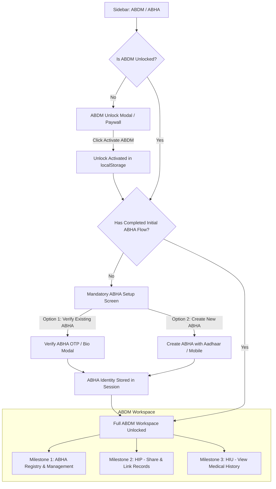

# ABDM & ABHA Module — Complete Design & Functional Specification

> **MantraAssist Healthcare Platform**  
> **Ayushman Bharat Digital Mission (ABDM) Integration Specification**  
> **Compliance Standard:** National Health Authority (NHA) & Ayushman Bharat Digital Mission (ABDM) v2.0 Sandbox & Production Architecture.

---

## 1. Executive Overview

The **ABDM / ABHA Module** in MantraAssist is an enterprise-grade, NHA-compliant digital health architecture integrated seamlessly into the MantraAssist SaaS clinical operating system. It empowers healthcare providers, clinics, and hospitals to seamlessly participate in India’s National Health Network through:
1. **Milestone 1 (M1):** ABHA Creation, Aadhaar / Mobile Verification & ABHA Card Management.
2. **Milestone 2 (M2) — HIP Role:** Health Information Provider linking, Encounter Care Context creation, Electronic Health Record (EHR) bundling via FHIR, and ABDM Gateway Push / Pull.
3. **Milestone 3 (M3) — HIU Role:** Health Information User consent management, Consent Artefact tracking, Instant Sandbox Granting, and Longitudinal Patient Medical History Timeline visualization.

---

## 2. Design System & Visual Language

The module adheres to the **MantraAssist Design System**, eliminating extraneous multi-color schemes in favor of a cohesive, high-trust healthcare aesthetic.

### 2.1 Color Tokens
- **Surfaces & Page Canvas:** Pure White (`#FFFFFF`, `bg-white`) paired with subtle neutral secondary surfaces (`#F8FAFC`, `bg-slate-50` / `bg-slate-100`).
- **Primary Brand Color:** MantraAssist Signature Blue (`#1456F0` / `#1147CC`), applied to primary actions, active navigation tabs, links, and key indicators.
- **Deep Slate / Navy Accent:** Dark Charcoal / Navy (`#181E25` to `#2C3E50`), used for major section banners, modal accents, and primary dark buttons.
- **Borders & Dividers:** Subtle blue-gray borders (`#E2E8F0`, `border-slate-200` / `border-slate-100`).
- **Badges & Status Elements:** High-contrast yet visually quiet badges:
  - Verified / Active: `bg-blue-50 text-[#1456F0] border-blue-200` or subtle emerald badges for granted consent.
  - Inactive / Secondary: `bg-slate-100 text-slate-700 border-slate-200`.

### 2.2 Branding & Official Trust Marks
The workspace exclusively presents three trust badges:
1. **MantraAssist Logo & Wordmark**
2. **ABDM Official Emblem & Mark**
3. **National Health Authority (NHA) Verification Mark**

---

## 3. End-to-End User Journeys & Architectural Flow

---

## 4. Module-by-Module Functional Deep Dive

### 4.1 Mandatory First-Time Onboarding Flow
- **Security & Access Gate:** Prevents clinical staff from querying or creating records in ABDM before establishing an authorized ABHA context.
- **State Persistence:** Guarded via reactive state (`isUnlocked` and `isABDMConfigured` backed by `localStorage`).
- **Choice-Driven Setup:**
  - **Verify Existing ABHA:** Direct lookup by 14-digit ABHA Number (`12-3456-7890-1234`) or ABHA Address (`name@abdm`). Supports instant OTP validation.
  - **Create New ABHA:** Streamlined Aadhaar-based or Mobile-based eKYC generation yielding a unique ABHA number, PHR address, and ABHA card.

---

### 4.2 Milestone 1 (M1): ABHA Creation & Registry

#### Key Capabilities:
- **Interactive Metrics & KPI Bar:**
  - *Active ABHA IDs:* Real-time count of connected patients.
  - *Verified via Aadhaar / Mobile:* Demographic authentication distribution.
  - *Linked Care Contexts:* Real-time linked clinical records count.
  - *Consent Artefacts:* Active data sharing agreements.
- **Action Cards:**
  1. **Create ABHA Number:** Direct modal wizard with real-time OTP simulation, profile generation, and automated validation.
  2. **Verify ABHA Number:** 3-mode verification (*Mobile OTP*, *Aadhaar OTP*, *Demographics Verification*).
  3. **ABHA Card Preview & Download:** High-fidelity ABDM card generation with dynamic QR code, photo placeholder, ABHA number, ABHA address, gender, and date of birth.
- **ABHA Patient Registry Table:**
  - Real-time search by Patient Name, ABHA Address, ABHA Number, or Mobile.
  - Patient detail modal view with complete eKYC demographics, linked care contexts, and instant action shortcuts.

---

### 4.3 Milestone 2 (M2): Health Information Provider (HIP)

#### Key Capabilities:
- **Care Context Linking (`LinkCareContextModal`):**
  - HIP-initiated care context linking.
  - Select registered patient & clinical encounter (OPD Consultation, Lab Diagnostics, Inpatient Visit).
  - Simulates ABDM Gateway linking OTP push notification and patient authorization.
- **Health Record Discovery (`DiscoverRecordsModal`):**
  - Queries ABDM Health Information Exchange & Consent Manager (HIE-CM).
  - Discovers existing health records for a patient across all connected network hospitals.
- **Share Health Records (`ShareRecordsModal`):**
  - Generates ABDM/NHA compliant HL7 FHIR Bundles.
  - Encrypts clinical payloads with ephemeral Diffie-Hellman keys.
  - Pushes bundles directly to the ABDM Health Data Gateway.
- **Consent Artefact Management (`ConsentManagementModal`):**
  - Comprehensive list of active, expired, and revoked consent artefacts.
  - Single-click consent revocation with instant status update in registry.

---

### 4.4 Milestone 3 (M3): Health Information User (HIU)

#### Key Capabilities:
- **Request Patient Consent (`RequestConsentModal`):**
  - Create granular consent requests specifying:
    - Target Health Information Types (Consultation Notes, Prescriptions, Lab Reports, Discharge Summaries).
    - Purpose of access (Clinical Care, Chronic Care Management, Diagnostic Review).
    - Date range validity (From Date to To Date).
  - Generates NHA-compliant consent request sent to the patient's ABHA PHR app (e.g., Aarogya Setu, ABHA app).
- **Patient Longitudinal Medical History Timeline (`MedicalHistoryTimeline`):**
  - **Consent-First Security Gate:** History is blocked if no valid consent artefact exists for the patient.
  - **Category Filters:** Filter records across *All*, *Consultation*, *Diagnostic Report*, *Hospital Visit*, and *Prescription*.
  - **Clinical Record Visualization:**
    - Doctor & facility metadata.
    - Diagnosis summary & ICD-10 notes.
    - Formatted vitals table (Blood Pressure, Pulse, Temperature, Weight).
    - Prescribed medications list (Drug name, dosage, frequency, duration).
    - Lab investigation values with reference ranges.
- **Pull Health Records (`GetRecordsModal`):**
  - Decrypts and fetches authorized FHIR bundles using patient-approved consent artefacts.

---

## 5. Technical Architecture & File Map

| Component / Service | File Path | Functional Purpose |
|---|---|---|
| **Main ABDM Workspace** | [`src/app/pages/ABDM.tsx`](file:///C:/Users/Mantracare/Desktop/abha/ma-figma/src/app/pages/ABDM.tsx) | Primary container, M1/M2/M3 segmented navigation, KPI metrics, ABHA registry table, and modal manager. |
| **ABDM Service Layer** | [`src/app/services/abdmService.ts`](file:///C:/Users/Mantracare/Desktop/abha/ma-figma/src/app/services/abdmService.ts) | State store, mock ABDM Gateway engine, OTP simulator, and FHIR generator. |
| **Mandatory ABHA Flow** | [`src/app/components/abdm/MandatoryABHASetup.tsx`](file:///C:/Users/Mantracare/Desktop/abha/ma-figma/src/app/components/abdm/MandatoryABHASetup.tsx) | First-run mandatory gate for ABHA verification/creation before unlocking the workspace. |
| **ABDM Unlock Modal** | [`src/app/components/abdm/ABDMUnlockModal.tsx`](file:///C:/Users/Mantracare/Desktop/abha/ma-figma/src/app/components/abdm/ABDMUnlockModal.tsx) | Paywall and activation trigger for the ABDM ecosystem. |
| **Create ABHA Modal** | [`src/app/components/abdm/CreateABHAModal.tsx`](file:///C:/Users/Mantracare/Desktop/abha/ma-figma/src/app/components/abdm/CreateABHAModal.tsx) | Aadhaar/Mobile-based ABHA creation wizard. |
| **Verify ABHA Modal** | [`src/app/components/abdm/VerifyABHAModal.tsx`](file:///C:/Users/Mantracare/Desktop/abha/ma-figma/src/app/components/abdm/VerifyABHAModal.tsx) | Real-time OTP / Demographic verification modal. |
| **ABHA Digital Card** | [`src/app/components/abdm/ABDMAuthCard.tsx`](file:///C:/Users/Mantracare/Desktop/abha/ma-figma/src/app/components/abdm/ABDMAuthCard.tsx) | Official ABDM digital health identity card preview & export. |
| **M2 HIP Dashboard** | [`src/app/components/abdm/m2/M2Dashboard.tsx`](file:///C:/Users/Mantracare/Desktop/abha/ma-figma/src/app/components/abdm/m2/M2Dashboard.tsx) | Health Information Provider workspace & action triggers. |
| **Link Care Context** | [`src/app/components/abdm/m2/LinkCareContextModal.tsx`](file:///C:/Users/Mantracare/Desktop/abha/ma-figma/src/app/components/abdm/m2/LinkCareContextModal.tsx) | Encounter-to-ABHA linking workflow. |
| **Discover Records** | [`src/app/components/abdm/m2/DiscoverRecordsModal.tsx`](file:///C:/Users/Mantracare/Desktop/abha/ma-figma/src/app/components/abdm/m2/DiscoverRecordsModal.tsx) | Cross-facility health record discovery. |
| **Share Records** | [`src/app/components/abdm/m2/ShareRecordsModal.tsx`](file:///C:/Users/Mantracare/Desktop/abha/ma-figma/src/app/components/abdm/m2/ShareRecordsModal.tsx) | FHIR Bundle builder and gateway push. |
| **Consent Management** | [`src/app/components/abdm/m2/ConsentManagementModal.tsx`](file:///C:/Users/Mantracare/Desktop/abha/ma-figma/src/app/components/abdm/m2/ConsentManagementModal.tsx) | Active consent artefacts viewer & revocation engine. |
| **M3 HIU Dashboard** | [`src/app/components/abdm/m3/M3Dashboard.tsx`](file:///C:/Users/Mantracare/Desktop/abha/ma-figma/src/app/components/abdm/m3/M3Dashboard.tsx) | Health Information User workspace & timeline trigger. |
| **Request Consent** | [`src/app/components/abdm/m3/RequestConsentModal.tsx`](file:///C:/Users/Mantracare/Desktop/abha/ma-figma/src/app/components/abdm/m3/RequestConsentModal.tsx) | Granular HIU consent request generator. |
| **Medical Timeline** | [`src/app/components/abdm/m3/MedicalHistoryTimeline.tsx`](file:///C:/Users/Mantracare/Desktop/abha/ma-figma/src/app/components/abdm/m3/MedicalHistoryTimeline.tsx) | Interactive consent-gated patient longitudinal EHR timeline. |
| **Pull Records** | [`src/app/components/abdm/m3/GetRecordsModal.tsx`](file:///C:/Users/Mantracare/Desktop/abha/ma-figma/src/app/components/abdm/m3/GetRecordsModal.tsx) | Decrypted FHIR health record data retrieval. |

---

## 6. Verification & Quality Checklist

- [x] **Strict Visual Language Match:** Clean white surfaces, MantraAssist Blue (`#1456F0`), and dark navy gradients.
- [x] **Zero Unintended Redesigns:** Sizing, spacing, layout, fonts, and responsiveness preserved across all breakpoints.
- [x] **Mandatory Entry Flow:** Locked -> Unlocked -> Mandatory First Step -> Full M1/M2/M3 Workspace.
- [x] **No Extraneous Sections:** Unwanted cards (e.g., "Health Record Format") completely excised.
- [x] **Fully Interactive Mock Services:** Functional state transitions, OTP simulation, local storage persistence, and dynamic toasts for every user action.
