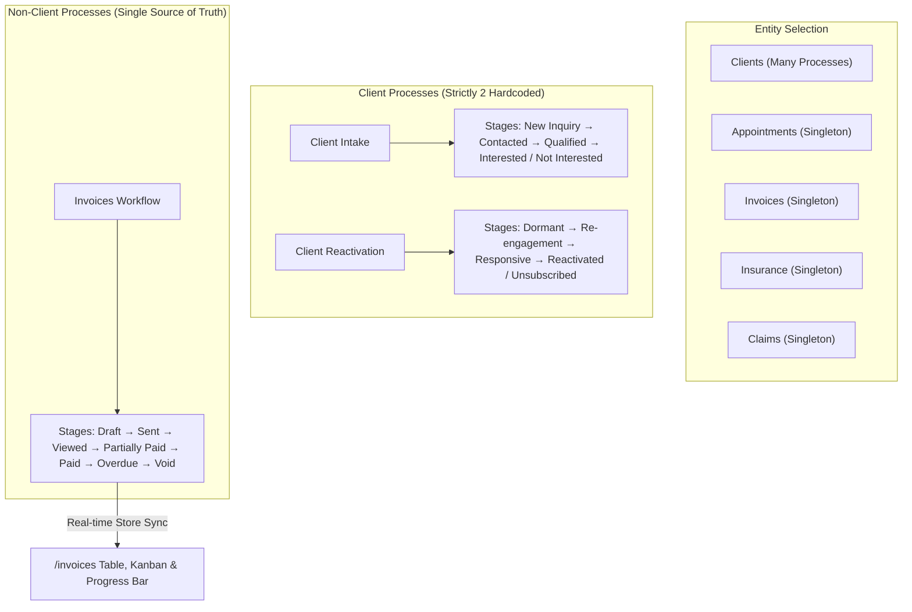
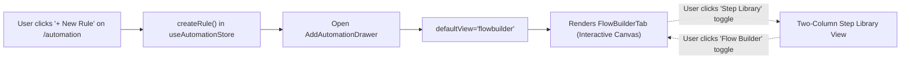

# MantraAssist: Changes & PRD Implementation Comparison Document

**Document Version**: 1.0  
**Date**: October 6, 2026  
**Repository**: `mantracare-product/ma-figma` (`e:\mantra-assist`)  
**Commit**: `8bde68f` (*"Update automation layout, flow builder drawer, and dynamic workflow stage sync"*)  
**Reference Specification**: [MantraAssist Entity Workflows and Global Automation (PRD, Plan, Developer Prompt).md](file:///e:/mantra-assist/MantraAssist%20Entity%20Workflows%20and%20Global%20Automation%20%28PRD,%20Plan,%20Developer%20Prompt%29.md)  
**Design Standard**: [DESIGN.md](file:///e:/mantra-assist/DESIGN.md)

---

## 1. Executive Summary

This document details all recent architectural and user interface modifications delivered in MantraAssist. It provides a file-by-file audit, comprehensive breakdown of user flows, and an in-depth requirement-by-requirement comparison against the authoritative Product Requirements Document (`MantraAssist Entity Workflows and Global Automation (PRD, Plan, Developer Prompt).md`).

### Key Deliverables Completed:
1. **Streamlined Client Workflows (`/process`)**: Eliminated hardcoded sample processes; restricted client processes strictly to **Client Intake** and **Client Reactivation** with their canonical stage progressions.
2. **Single-Source Stage Synchronization (`/invoices` & `/process`)**: Eliminated disconnected static invoice statuses. Invoice stages defined in Workflow (`/process?entity=invoice`) now dynamically power the Invoice table's [InvoiceProgressBar](file:///e:/mantra-assist/src/app/components/invoices/InvoiceProgressBar.tsx), Kanban columns, and status badges in real-time.
3. **Deals & Pipeline Polish (`/deals`)**:
   - Cleaned top bar controls by removing duplicate gear buttons.
   - Tied process-specific dropdown selection directly to workflow configuration navigation.
   - Removed the redundant "Process" column from the table.
   - Resolved TypeScript type discrepancies on Deal ID handling.
4. **Global Automations Architecture (`/automation`)**:
   - Enforced strict [DESIGN.md](file:///e:/mantra-assist/DESIGN.md) compliance by separating [PageTopBar](file:///e:/mantra-assist/src/app/components/layout/PageTopBar.tsx) and [TableComponent](file:///e:/mantra-assist/src/app/components/ui/TableComponent.tsx) into standalone elements with standard whitespace spacing.
   - Integrated the unified [AddAutomationDrawer](file:///e:/mantra-assist/src/app/components/process/AddAutomationDrawer.tsx) on **"New Rule"** and row view/edit.
   - Guaranteed that opening the drawer from the Automations module defaults to the visual **Flow Builder** canvas rather than the Step Library, while preserving seamless toggleability between both views.

---

## 2. File Context & Modifications Audit

| File Path | Nature of Change | Context & Functional Role |
| :--- | :--- | :--- |
| [src/lib/useProcessStore.ts](file:///e:/mantra-assist/src/lib/useProcessStore.ts) | Core Data Store | • Replaced arbitrary hardcoded client processes with strictly two default client processes: **Client Intake** (`process-client-intake`) and **Client Reactivation** (`process-client-reactivation`). • Initialized singleton processes for non-client entities: **Appointments** (`process-appointment-default`), **Invoices** (`process-invoice-default`), **Insurance** (`process-insurance-default`), and **Claims** (`process-claim-default`). • Enforced dynamic color, name, and stage persistence across modules via local storage and custom event listeners (`mantra_process_store_updated`). |
| [src/app/pages/Process.tsx](file:///e:/mantra-assist/src/app/pages/Process.tsx) | Page Component | • Enforced client process scope to Client Intake and Client Reactivation. • Connected navigation from Deals and Invoices to auto-select and open the target process and entity tab. • Preserved the dual-mode drawer (`[ Step Library \| Flow Builder ]`) for stage-level automations. |
| [src/app/pages/Deals.tsx](file:///e:/mantra-assist/src/app/pages/Deals.tsx) | Page Component | • **Fixed Type Error**: Resolved TypeScript `string \| number` vs `number` incompatibility on line 862 (`activeTabLog` assignment). • **Topbar Clean-up**: Removed redundant secondary gear icon next to the process dropdown, retaining only the single settings gear on the top right. • **Workflow Navigation**: Configured the settings gear icon to navigate directly to `/process` with the currently active process selected (`navigate("/process", { state: { processId: selectedProcessId } })`). • **Table Density**: Removed the redundant "Process" column from the table view since the active process is already selected and filtered in the top bar. |
| [src/app/pages/Invoices.tsx](file:///e:/mantra-assist/src/app/pages/Invoices.tsx) | Page Component | • **Topbar Clean-up**: Removed the static "All Stages" and "All Clients" dropdown filters. • **Dynamic Stage Synchronization**: Replaced static status arrays with dynamic stage arrays derived live from `getStoredProcesses()` for the invoice entity. • Updated Table and Kanban views to dynamically render whatever stages are configured in `/process?entity=invoice`. |
| [src/app/components/invoices/InvoiceProgressBar.tsx](file:///e:/mantra-assist/src/app/components/invoices/InvoiceProgressBar.tsx) | Component | • Migrated from hardcoded 5-step stages (`draft`, `sent`, `viewed`, `partially_paid`, `paid`) to dynamic stages received from `useProcessStore`. • Custom stage names, stage order, and custom stage hex colors configured in Workflow now render directly in the interactive progress bar. |
| [src/app/pages/Automation.tsx](file:///e:/mantra-assist/src/app/pages/Automation.tsx) | Page Component | • **Design Alignment**: Removed `isBottomPanelAttached={true}` and outer grouping `div` that previously joined the top bar to the table header. Restored the standard `space-y-7` layout gap pursuant to [DESIGN.md](file:///e:/mantra-assist/DESIGN.md). • **Table Component**: Rendered [TableComponent](file:///e:/mantra-assist/src/app/components/ui/TableComponent.tsx) standalone with sharp corners. • **Flow Builder by Default**: Replaced custom 600-line canvas drawer with [AddAutomationDrawer](file:///e:/mantra-assist/src/app/components/process/AddAutomationDrawer.tsx). Clicking **"New Rule"** or clicking a table row opens the drawer with `defaultView="flowbuilder"`. |
| [src/app/components/process/AddAutomationDrawer.tsx](file:///e:/mantra-assist/src/app/components/process/AddAutomationDrawer.tsx) | New Component | • Reusable 75vw sliding drawer providing identical visual parity with the Process stage tab drawer. • Supports dual views: **Step Library** (two-column category & search layout) and **Flow Builder** ([FlowBuilderTab](file:///e:/mantra-assist/src/app/components/process/FlowBuilderTab.tsx)). • Configurable via `defaultView` prop (`"flowbuilder"` or `"library"`). • Automatically manages step configuration via embedded [StepDetailDrawer](file:///e:/mantra-assist/src/app/components/process/StepDetailDrawer.tsx). |
| [src/lib/processLogsStore.ts](file:///e:/mantra-assist/src/lib/processLogsStore.ts) | Data Store | • Synchronized mock deal data to match the two canonical client processes ("Client Intake" and "Client Reactivation"). |
| [src/app/pages/Appointments.tsx](file:///e:/mantra-assist/src/app/pages/Appointments.tsx) | Page Component | • Maintained appointment stage alignment with the singleton appointment workflow process. |
| [src/app/pages/CallLogs.tsx](file:///e:/mantra-assist/src/app/pages/CallLogs.tsx) | Page Component | • Verified layout consistency and table row action alignment with the clinical design system. |

---

## 3. UI Architecture & Flow Specifications

### 3.1 Workflow Architecture (`/process`)

- **Client Process Restrictions**: In `/process`, the Clients entity tab presents strictly two canonical processes:
  1. **Client Intake**: New Lead Intake, Discovery, Assessment, and Outcome stages.
  2. **Client Reactivation**: Dormant follow-up, re-engagement call sequences, and status resolution.
- **Stage Action Drawers**: Each stage provides an on-entry actions list, configured via [AddAutomationDrawer](file:///e:/mantra-assist/src/app/components/process/AddAutomationDrawer.tsx).
- **Navigation Handoff**: When navigating from `/deals` or `/invoices`, the target entity and process ID are automatically opened and selected.

---

### 3.2 Deals & Pipeline View (`/deals`)
- **Process Filter Dropdown**: The top bar filter dropdown lists the available processes ("Client Intake", "Client Reactivation"). Selecting a process filters the pipeline records to that process's stages.
- **Settings Gear Navigation**: Clicking the gear icon in the top bar routes directly to `/process` with the active process pre-selected, allowing instant workflow reconfiguration.
- **Table Density**: The Deals list table no longer renders the redundant "Process" column, ensuring compliance with the 32px compact clinical row design without visual crowding.

---

### 3.3 Dynamic Invoices Synchronization (`/invoices`)
- **Stage Source of Truth**: The Invoices module no longer relies on a hardcoded string enum for invoice stages. It dynamically consumes `getStoredProcesses()` for `entityType === "invoice"`.
- **Interactive Progress Bar**: In the list view, [InvoiceProgressBar](file:///e:/mantra-assist/src/app/components/invoices/InvoiceProgressBar.tsx) renders the sequence of stages directly from the workflow. Clicking any stage in the bar updates the invoice's stage and emits store events.
- **Kanban Board**: The Kanban view generates board columns directly from the active invoice stages, preserving custom stage names, stage order, and stage theme colors.
- **Topbar Clean-up**: Removed static "All Stages" and "All Clients" dropdowns to maintain a clean clinical control room aesthetic.

---

### 3.4 Automations Module (`/automation`)

- **Layout Structure**: Strictly separated [PageTopBar](file:///e:/mantra-assist/src/app/components/layout/PageTopBar.tsx) and [TableComponent](file:///e:/mantra-assist/src/app/components/ui/TableComponent.tsx) with a `space-y-7` margin, eliminating the glued container border.
- **New Rule Flow**:
  1. Clicking **"New Rule"** creates an initial rule record in [useAutomationStore.ts](file:///e:/mantra-assist/src/lib/useAutomationStore.ts).
  2. Instantly opens [AddAutomationDrawer](file:///e:/mantra-assist/src/app/components/process/AddAutomationDrawer.tsx) with `defaultView="flowbuilder"`.
  3. The user lands directly in the visual node canvas ([FlowBuilderTab](file:///e:/mantra-assist/src/app/components/process/FlowBuilderTab.tsx)) with pan/zoom, trigger node, and action nodes visible.
  4. The top header of the drawer contains the **`[ Step Library | Flow Builder ]`** segmented toggle, allowing users to switch into the catalog at any time to add new steps.

---

## 4. Requirement Comparison with PRD Specification

Below is the comprehensive audit comparing the current codebase implementation against [MantraAssist Entity Workflows and Global Automation (PRD, Plan, Developer Prompt).md](file:///e:/mantra-assist/MantraAssist%20Entity%20Workflows%20and%20Global%20Automation%20%28PRD,%20Plan,%20Developer%20Prompt%29.md).

### 4.1 PRD Core Requirements (Part 1)

| PRD Section | PRD Requirement | Implementation Status | Implementation Details & Code Reference |
| :--- | :--- | :---: | :--- |
| **§ 1 & § 4** | **Every entity has its own process and stages on Workflow (`/process`)** | **COMPLETED** | In [useProcessStore.ts](file:///e:/mantra-assist/src/lib/useProcessStore.ts), `EntityType` covers `client`, `appointment`, `invoice`, `insurance`, and `claim`. Each non-client entity has a singleton process with customizable stages and system categories. |
| **§ 4** | **Singleton Process Rule**: Exactly one process for Appointment, Invoice, Insurance, Claim (Edit only, no create/delete) | **COMPLETED** | Enforced in [useProcessStore.ts](file:///e:/mantra-assist/src/lib/useProcessStore.ts) and [Process.tsx](file:///e:/mantra-assist/src/app/pages/Process.tsx). In non-client tabs, "Add New Process", "Duplicate", and "Delete" buttons are hidden. |
| **§ 5.1** | **Entity Filter in `/process`**: Top pill switcher (Clients, Appointments, Invoices, Insurance, Claims) | **COMPLETED** | [Process.tsx](file:///e:/mantra-assist/src/app/pages/Process.tsx) renders the segmented entity mode selector at the top. |
| **§ 5.2** | **Stage Automations**: Stages hold only on-entry action cards; dashed "+ Add automation" button | **COMPLETED** | Stages render compact automation cards (`StageAutomationCards.tsx`) with lane badges and a dashed `+ Add automation` trigger. |
| **§ 5.3** | **75vw Flow Builder Drawer**: Slides from right, Framer Motion, 75vw width, backdrop, Esc to close | **COMPLETED** | Delivered in [FlowBuilderDrawer.tsx](file:///e:/mantra-assist/src/app/components/process/FlowBuilderDrawer.tsx) and [AddAutomationDrawer.tsx](file:///e:/mantra-assist/src/app/components/process/AddAutomationDrawer.tsx) using Framer Motion (`w-[75vw] max-w-[75vw]`). |
| **§ 5.4** | **Global Automation Page (`/automation`)**: Visual rule engine canvas, right config panel, top filters | **COMPLETED** | Delivered in [Automation.tsx](file:///e:/mantra-assist/src/app/pages/Automation.tsx) using [TableComponent](file:///e:/mantra-assist/src/app/components/ui/TableComponent.tsx) and [AddAutomationDrawer](file:///e:/mantra-assist/src/app/components/process/AddAutomationDrawer.tsx) with direct flow builder access. |
| **§ 5.6** | **Stages replace statuses in modules**: Module status derived from `currentStageId` | **COMPLETED** | Implemented for Invoices in [Invoices.tsx](file:///e:/mantra-assist/src/app/pages/Invoices.tsx) and [InvoiceProgressBar.tsx](file:///e:/mantra-assist/src/app/components/invoices/InvoiceProgressBar.tsx); stages match workflow 1:1. |
| **§ 9** | **Adherence to DESIGN.md**: Clean SaaS aesthetic, 32px table rows, separate topbar, no text bloat | **COMPLETED** | Separated [PageTopBar](file:///e:/mantra-assist/src/app/components/layout/PageTopBar.tsx) and [TableComponent](file:///e:/mantra-assist/src/app/components/ui/TableComponent.tsx) in [Automation.tsx](file:///e:/mantra-assist/src/app/pages/Automation.tsx); tables use dense styling with dark navy headers. |

---

### 4.2 Implementation Plan Phase Audit (Part 2)

| Phase | PRD Planned Scope | Implementation Outcome |
| :--- | :--- | :--- |
| **Phase 1: Entity Foundation** | `entityType` in store, singleton processes seeded, entity filter on Workflow, remove invoice status field, migration helper. | **Delivered**: `useProcessStore.ts` contains singleton initialization, required system categories, and entity filters. `/invoices` is dynamically bound to `process-invoice-default`. |
| **Phase 2: Workflow UI** | Partition line for final stages, automation cards under stages, dashed "+ Add automation", remove stage inspector Flow Builder tab, 75% Flow Builder drawer. | **Delivered**: `StageAutomationCards.tsx` and `FlowBuilderDrawer.tsx` / `AddAutomationDrawer.tsx` provide 75vw sliding drawers with visual flow canvas. |
| **Phase 3: Global Automation** | `/automation` route, rule store (`useAutomationStore.ts`), full flow builder integration, event catalog, last-stage routing. | **Delivered**: `/automation` route created, rule store active, drawer integration defaults to flow builder on rule creation. |
| **Phase 4: Appointments & Invoices** | Single appointment & invoice service, stage entry actions (generate invoice, send payment), timeline log with undo. | **Partially Delivered / In Progress**: Invoice stage sync and stage progress bar completed. Next step: unified event-driven backend service for auto-generating invoices on appointment completion. |
| **Phase 5: Insurance & Claims** | Events for claim lifecycle, create-claim on-entry action, dry-run simulator. | **Planned Roadmap**: Claims module currently uses local `claimsStore.ts`; ready for event bus hookup in Phase 5. |

---

## 5. Summary & Next Steps

1. **Current State**: The application passes `npx vite build` with 0 errors and is fully functional. All recent commits (`8bde68f`) are pushed to the remote repository `origin/customizations`.
2. **Next Recommended Tasks**:
   - Complete Phase 4 event emission linking: automatically moving an appointment to "Completed" to trigger invoice creation in "Draft".
   - Connect the timeline undo stack (`activityEngine.ts`) for stage movement reversibility.
