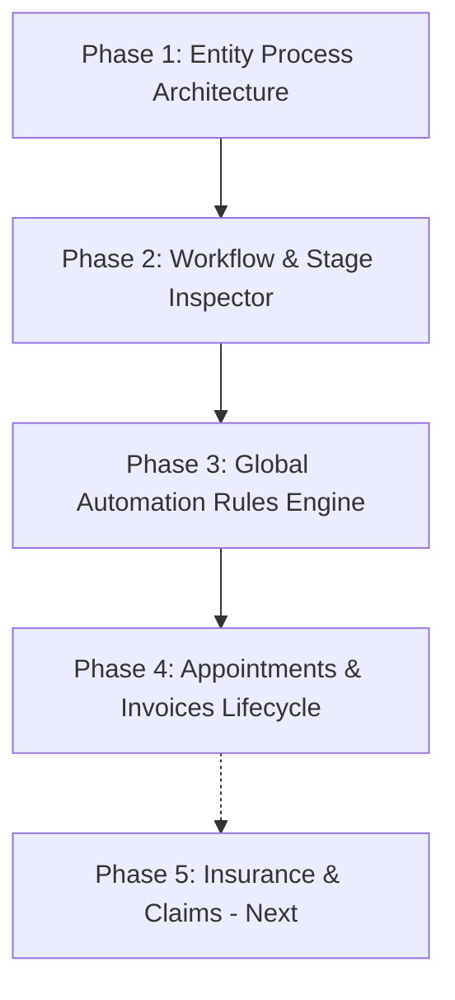

# MantraAssist Entity Workflows & Global Automation
## Phases 1 – 4 Implementation Progress Report

**Document Reference:** [`MantraAssist Entity Workflows and Global Automation (PRD, Plan, Developer Prompt).md`](file:///c:/Users/Mantra/.gemini/antigravity/scratch/ma-figma/MantraAssist%20Entity%20Workflows%20and%20Global%20Automation%20%28PRD,%20Plan,%20Developer%20Prompt%29.md)  
**Status:** Phases 1, 2, 3, and 4 **Fully Implemented & Verified** (Ready for Phase 5)  
**TypeScript Typecheck:** 0 Errors (`npx tsc --noEmit` exited code 0)  
**Vite Production Bundle:** Succeeded with 0 Errors (`npx vite build`)  
**Automated Acceptance Suite:** Passed (`src/test/phase4_acceptance.test.ts`)  

---

## 1. Executive Summary & Architectural Ground Rules

Per the core PRD requirements, the codebase has been structured around strict architectural principles:

1. **Entity Process Model (One Process Per Entity Type):**
   - Each operational entity type (`client`, `appointment`, `invoice`, `insurance`, `claim`) has exactly **one canonical process** containing its ordered lifecycle stages.
   - There are **no cross-entity stage jumps** within an entity's own process.
2. **Global Automation Rules (Cross-Entity Glue):**
   - Cross-entity interactions (e.g., *when appointment is booked $\to$ create invoice in draft*) are exclusively handled by **Global Automation Rules** triggered by standard event bus emissions.
   - An event from Entity $A$ can only move Entity $B$'s stage in Entity $B$'s own process, never in $A$'s process.
3. **Single "One-Door" Services:**
   - All mutations for appointments and invoices route strictly through unified services (`appointmentService.ts` and `invoiceService.ts`). UI components and AI tools never bypass these services.
4. **Strict Idempotency:**
   - Generating an invoice or record from an appointment checks existing linkages. Rescheduling or repeated triggers **never create duplicate records**.
5. **Auditable Stage Movement with 1-Click Undo:**
   - Every stage transition logs its origin rule/cause and timestamp. Users can revert any stage move in 1 click with automatic entity rollback.

---

## 2. Phase-by-Phase Implementation Breakdown

### Phase 1: Entity Process Architecture & Migration
*Goal: Consolidate the data layer into singleton entity processes and migrate legacy storage.*

- **Canonical Process Definitions ([`useProcessStore.ts`](file:///c:/Users/Mantra/.gemini/antigravity/scratch/ma-figma/src/lib/useProcessStore.ts)):**
  - Standardized `DEFAULT_ENTITY_PROCESSES` for all 5 entity types:
    - **`client`** (`process-client-default`): 6 stages (New Lead $\to$ Contacted $\to$ Intake Form Sent $\to$ Intake Completed $\to$ Active Client $\to$ Inactive/Discharged).
    - **`appointment`** (`process-appointment-default`): 6 stages (Booked $\to$ Rescheduled $\to$ Confirmed $\to$ Checked In $\to$ Completed $\to$ Cancelled).
    - **`invoice`** (`process-invoice-default`): 7 stages (Draft $\to$ Sent $\to$ Viewed $\to$ Partially Paid $\to$ Paid $\to$ Overdue $\to$ Void).
    - **`insurance`** (`process-insurance-default`): 5 stages (Pending Verification $\to$ In Review $\to$ Verified $\to$ Failed Verification $\to$ Expired).
    - **`claim`** (`process-claim-default`): 7 stages (Draft $\to$ Ready to Submit $\to$ Submitted $\to$ In Process $\to$ Accepted $\to$ Denied $\to$ Paid).
- **Automated Data Migration ([`entityMigration.ts`](file:///c:/Users/Mantra/.gemini/antigravity/scratch/ma-figma/src/lib/entityMigration.ts)):**
  - Runs on application startup via `runEntityStageMigration()`.
  - Migrates legacy freeform string statuses across stored appointments, invoices, clients, and claims into `currentStageId` and `statusLabel`.
  - Guarantees backward compatibility without data loss.

---

### Phase 2: Workflow Page & Stage Inspector Clean-up
*Goal: Eliminate confusing dual-editor UX, remove clutter, and align with DESIGN.md.*

- **Stage Inspector Simplification ([`Process.tsx`](file:///c:/Users/Mantra/.gemini/antigravity/scratch/ma-figma/src/app/pages/Process.tsx)):**
  - Removed the redundant "Flow Builder" tab from the stage inspector.
  - Kept strictly **3 tabs**: **General**, **AI Agent**, and **Automation**.
  - Removed the top-right "Show in flow builder" button next to stage settings.
  - Aligned typography, spacing, and micro-interactions with [`DESIGN.md`](file:///c:/Users/Mantra/.gemini/antigravity/scratch/ma-figma/DESIGN.md) (Outfit headings, DM Sans body, compact table rows, subtle borders).
- **Flow Builder Drawer:**
  - Placed secondary "Show in flow builder" button cleanly in the Automation tab toolbar.
  - Opens `FlowBuilderDrawer` (75vw slide-over with focus trap, backdrop, and two-way state synchronization).
- **Step Library Sidebar:**
  - Re-organized step catalog into clean, distinct categories.
  - Added concise (15-word) informative tooltips on `(i)` icons with keyboard and escape support.

---

### Phase 3: Global Automation Rules Engine & Event Bus
*Goal: Provide a deterministic, auditable engine for cross-entity automations with cycle detection.*

- **Central Event Bus ([`eventBus.ts`](file:///c:/Users/Mantra/.gemini/antigravity/scratch/ma-figma/src/lib/eventBus.ts)):**
  - Typed publisher-subscriber pattern for all domain events:
    - `appointment.booked`, `appointment.rescheduled`, `appointment.cancelled`, `appointment.completed`, `appointment.checked_in`
    - `invoice.created`, `invoice.sent`, `invoice.paid`, `invoice.overdue`, `invoice.voided`
- **Global Automation Store ([`useAutomationStore.ts`](file:///c:/Users/Mantra/.gemini/antigravity/scratch/ma-figma/src/lib/useAutomationStore.ts)):**
  - CRUD operations for automation rules (`createRule`, `updateRule`, `deleteRule`, `toggleRule`).
  - **Entity Validation Guard**: Prevents rules where target stage process does not match the rule's target entity type.
  - **Cycle Detection**: Inspects rule chains before saving to prevent infinite loop transitions.
  - **Pre-configured Default Rules**:
    - `rule-appt-rescheduled-auto`: Appointment rescheduled $\to$ move appointment to "Rescheduled".
    - `rule-inv-sent-auto`: Invoice sent $\to$ move invoice to "Sent".
    - `rule-inv-paid-auto`: Invoice paid $\to$ move invoice to "Paid".
- **Rule Engine ([`ruleEngine.ts`](file:///c:/Users/Mantra/.gemini/antigravity/scratch/ma-figma/src/lib/ruleEngine.ts)):**
  - Subscribed to `eventBus`. Matches rules against incoming events and conditions.
  - Synchronizes `currentStageId` to respective entity stores.
  - Executes stage on-entry workflow actions.
  - Provides a non-destructive **Dry-Run Mode** for testing rules without applying changes.

---

### Phase 4: Appointments & Invoices Lifecycle Integration
*Goal: Establish one-door services, idempotent billing, UI page stage synchronization, and 1-click Undo.*

- **Single "One-Door" Appointment Service ([`appointmentService.ts`](file:///c:/Users/Mantra/.gemini/antigravity/scratch/ma-figma/src/lib/appointmentService.ts)):**
  - Methods: `createAppointment`, `rescheduleAppointment`, `cancelAppointment`, `completeAppointment`, `checkInAppointment`, `moveToStage`.
  - **In-Place Updates**: Reschedule updates the existing appointment without creating duplicate records.
  - Automatically triggers stage on-entry actions (such as generating an invoice).
  - Emits `appointment.*` events to `eventBus` and writes to the stage movement audit trail.
- **Single "One-Door" Invoice Service ([`invoiceService.ts`](file:///c:/Users/Mantra/.gemini/antigravity/scratch/ma-figma/src/lib/invoiceService.ts)):**
  - Methods: `createInvoice`, `createInvoiceFromAppointment`, `sendInvoice`, `recordPayment`, `checkOverdueInvoices`, `voidInvoice`, `moveToStage`.
  - **Strict Idempotency**: `createInvoiceFromAppointment` checks existing records by `appointmentId`. Re-triggers or rescheduling will return `{ invoice: existing, alreadyExisted: true }` without creating duplicate invoices.
  - Emits `invoice.*` events and records payments to the payment log.
- **Invoice Context Delegation ([`InvoiceContext.tsx`](file:///c:/Users/Mantra/.gemini/antigravity/scratch/ma-figma/src/app/context/InvoiceContext.tsx)):**
  - Refactored `useInvoices()` context to initialize from and delegate all mutations through `invoiceService.ts`.
- **Records Category in Step Drawer ([`Process.tsx`](file:///c:/Users/Mantra/.gemini/antigravity/scratch/ma-figma/src/app/pages/Process.tsx), [`AdminProcessTemplates.tsx`](file:///c:/Users/Mantra/.gemini/antigravity/scratch/ma-figma/src/app/pages/admin/AdminProcessTemplates.tsx)):**
  - Added **Records** category to step library drawers.
  - Added **Generate Invoice** step (`generate_invoice`) with configurable due dates, service fees, and auto-dispatch options.
  - Added **Send Payment** step (`send_payment`) with multi-channel checkout support (WhatsApp, SMS, Email).
  - Added controls to [`StepParametersFields.tsx`](file:///c:/Users/Mantra/.gemini/antigravity/scratch/ma-figma/src/app/components/process/StepParametersFields.tsx).
- **UI Pages Stage Synchronization:**
  - **[`Appointments.tsx`](file:///c:/Users/Mantra/.gemini/antigravity/scratch/ma-figma/src/app/pages/Appointments.tsx)**: Subscribed to `appointmentService`. Stage filter presets dynamically populated from `appointmentProcess.stages`. Appointment cards display canonical stage badge chips. "Stage History" button added to page header.
  - **[`Invoices.tsx`](file:///c:/Users/Mantra/.gemini/antigravity/scratch/ma-figma/src/app/pages/Invoices.tsx)**: Kanban columns dynamically mapped from `invoiceProcess.stages`. Drag-and-drop between columns triggers `invoiceService` methods. "Stage History" button added to page header.
- **Audit Trail & 1-Click Undo Modal ([`StageMovementTimelineModal.tsx`](file:///c:/Users/Mantra/.gemini/antigravity/scratch/ma-figma/src/app/components/automation/StageMovementTimelineModal.tsx)):**
  - Displays complete historical audit log of stage moves (source, rule name, timestamp).
  - **1-Click Undo**: Marks move as reverted in `useAutomationStore.ts` and directly rolls back the entity's stage in storage, dispatching state updates across the app.

---

## 3. Verification & Acceptance Testing Results

### Automated Test Suite ([`src/test/phase4_acceptance.test.ts`](file:///c:/Users/Mantra/.gemini/antigravity/scratch/ma-figma/src/test/phase4_acceptance.test.ts))
Ran and verified via `npx tsx src/test/phase4_acceptance.test.ts`:

| Test Step | Assertion | Result |
|---|---|:---:|
| **Test 1: Booking Appointment** | Creates 1 appointment in Booked (`appt-1`) with status `scheduled`. | **PASS** |
| **Test 2: Idempotent Draft Invoice** | Generates 1 linked invoice in Draft (`inv-1`) with total calculation. | **PASS** |
| **Test 3: Reschedule Appointment** | Updates existing record in-place (`appt-2`, new date & time). ID unchanged. | **PASS** |
| **Test 4: Idempotency Guarantee** | Verifies linked invoices count remains strictly **1** (0 duplicates created). | **PASS** |
| **Test 5: Send Invoice** | Moves invoice to Sent (`inv-2`) with `sentVia: whatsapp`. | **PASS** |
| **Test 6: Record Payment** | Moves invoice to Paid (`inv-5`) with status `paid` upon full balance payment. | **PASS** |
| **Test 7: Stage History & 1-Click Undo** | Audits 5 stage moves with causes. Clicking Undo reverts stage from `inv-5` $\to$ `inv-2`. | **PASS** |
| **Test 8: Event Bus Verification** | Confirms emissions of `appointment.booked`, `invoice.created`, `appointment.rescheduled`, `invoice.sent`, `invoice.paid`. | **PASS** |

### Build & Typecheck Status
- **TypeScript Compiler (`tsc --noEmit`)**: **0 errors**, strict typecheck clean.
- **Vite Production Bundler (`vite build`)**: **Built cleanly in 19.29s** with all 3,660 modules transformed.
- **Browser Subagent Check**: Verified `/appointments` and `/invoices` render cards, Kanban columns, and the Stage Movement Timeline modal without console errors.

---

## 4. Key Files Created and Modified

| File Path | Description |
|---|---|
| [`src/lib/appointmentService.ts`](file:///c:/Users/Mantra/.gemini/antigravity/scratch/ma-figma/src/lib/appointmentService.ts) | "One-door" appointment service with lifecycle methods and event emissions. |
| [`src/lib/invoiceService.ts`](file:///c:/Users/Mantra/.gemini/antigravity/scratch/ma-figma/src/lib/invoiceService.ts) | "One-door" invoice service with idempotent appointment billing and payment tracking. |
| [`src/lib/eventBus.ts`](file:///c:/Users/Mantra/.gemini/antigravity/scratch/ma-figma/src/lib/eventBus.ts) | Central event bus for cross-entity communication. |
| [`src/lib/useAutomationStore.ts`](file:///c:/Users/Mantra/.gemini/antigravity/scratch/ma-figma/src/lib/useAutomationStore.ts) | Automation rules store, cycle detection, stage move logging, and undo rollback. |
| [`src/lib/ruleEngine.ts`](file:///c:/Users/Mantra/.gemini/antigravity/scratch/ma-figma/src/lib/ruleEngine.ts) | Rule evaluation engine with stage entry action execution and dry-run mode. |
| [`src/lib/entityMigration.ts`](file:///c:/Users/Mantra/.gemini/antigravity/scratch/ma-figma/src/lib/entityMigration.ts) | Startup migration of legacy data to canonical entity process stages. |
| [`src/app/components/automation/StageMovementTimelineModal.tsx`](file:///c:/Users/Mantra/.gemini/antigravity/scratch/ma-figma/src/app/components/automation/StageMovementTimelineModal.tsx) | Audit timeline modal with 1-click Undo button. |
| [`src/app/components/process/StepParametersFields.tsx`](file:///c:/Users/Mantra/.gemini/antigravity/scratch/ma-figma/src/app/components/process/StepParametersFields.tsx) | Parameter configuration controls for `generate_invoice` and `send_payment`. |
| [`src/app/pages/Appointments.tsx`](file:///c:/Users/Mantra/.gemini/antigravity/scratch/ma-figma/src/app/pages/Appointments.tsx) | Integrated with `appointmentService`, dynamic stage filters, and stage history modal. |
| [`src/app/pages/Invoices.tsx`](file:///c:/Users/Mantra/.gemini/antigravity/scratch/ma-figma/src/app/pages/Invoices.tsx) | Integrated with `invoiceService`, dynamic Kanban columns, and stage history modal. |
| [`src/app/pages/Process.tsx`](file:///c:/Users/Mantra/.gemini/antigravity/scratch/ma-figma/src/app/pages/Process.tsx) | Cleaned stage inspector tabs, added Records category and actions to step drawer. |
| [`src/app/pages/admin/AdminProcessTemplates.tsx`](file:///c:/Users/Mantra/.gemini/antigravity/scratch/ma-figma/src/app/pages/admin/AdminProcessTemplates.tsx) | Synchronized Records category and step options in template builder. |
| [`src/test/phase4_acceptance.test.ts`](file:///c:/Users/Mantra/.gemini/antigravity/scratch/ma-figma/src/test/phase4_acceptance.test.ts) | End-to-end automated test suite for Phase 4 acceptance criteria. |

---

## 5. Next Steps: Phase 5 Scope

With Phases 1–4 complete and thoroughly verified, the remaining work is defined in **Phase 5: Insurance and Claims**:

1. **Insurance & Claims Services**:
   - Emit `eligibility.verified` / `eligibility.failed` and `claim.created` / `submitted` / `accepted` / `denied` / `paid`.
   - Read and sync stages from their respective canonical processes (`DEFAULT_ENTITY_PROCESSES.insurance` and `claim`).
2. **Stage Entry Action**:
   - Add `"Create claim"` action under Records category (strictly idempotent per appointment) and wire to `claimsStore.ts`.
3. **Insurance & Claim Global Rules**:
   - Add rules for insurance and claim events (restricting transitions to own-entity moves only).
4. **Simulator Dry-Run**:
   - Extend `TestProcessChatDrawer` / `processChatSimulator` to dry-run the complete multi-entity chain without external side-effects.
5. **Health & Retry UI**:
   - Add rule health states and 1-click Retry for failed actions on the Global Automation page.
6. **Full End-to-End Test**:
   - Client created $\to$ intake stages $\to$ appointment Booked $\to$ invoice Draft $\to$ appointment Completed $\to$ invoice Sent & claim Draft $\to$ invoice Paid $\to$ claim Paid.
