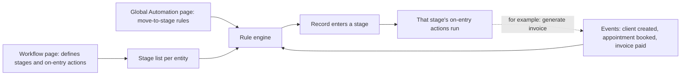
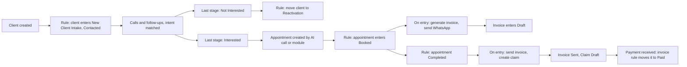

# MantraAssist: Entity Workflows and Global Automation

PRD, Implementation Plan and Developer Prompt · Product: Navodya · Draft v1 · Oct 6, 2026

# Part 1: PRD

## 1. Summary

Today only **client processes** have stages. Appointments, invoices, insurance and claims have their own separate statuses, and nothing connects them. We will:

1. Give every entity (Clients, Appointments, Invoices, Insurance, Claims) its **own process and stages** on the Workflow page. The stages become the module's statuses.
2. Keep **stage automations** simple: they only say what happens when a stage is *entered*.
3. Add a new **Global Automation** page, a full flow builder where all **move-to-stage rules** live, starting from "Client created".

## 2. Problem

- Booking, rescheduling or cancelling an appointment does not move any stage, and a reschedule call moves a stage but not the appointment.
- Invoices, insurance and claims have fixed statuses nobody can customize or automate.
- Automations can only be set inside client processes, so modules cannot get calls, messages or follow-ups.
- There is no single place to see how a client travels through the whole system.
- There is no rollback and no history of why something moved.

**Root cause:** the same fact ("the appointment is booked") lives in two places, and no rule connects them.

## 3. Goals and non-goals

**Goals:** one source of truth per fact; every record has exactly one stage; all movement rules visible and editable in one place; the Workflow UI stays familiar.

**Non-goals (for now):** multiple processes per entity (except clients), new AI voice features, payment gateway changes, a backend rewrite.

## 4. The model in one table

|  | Client processes | Appointment, Invoice, Insurance, Claim |
| --- | --- | --- |
| How many | Many | **Exactly one each** |
| Create or delete | Yes | **No.** Edit only |
| What a stage means | Where the client is in a journey | **The record's status** |
| Unit that has a stage | The client (one stage per process) | Each record (each invoice has its own stage) |

**Two places, two jobs:**

| Where | Only job |
| --- | --- |
| Workflow → a stage | What **runs when the stage is entered** (generate invoice, create claim, send payment, send WhatsApp, call) |
| Global Automation page | **Move-to-stage rules**: "when this happens, move to this stage" |



Stage entry is the only trigger for actions. A move rule puts a record into a stage, and that stage's actions then run.

## 5. Requirements

### 5.1 Workflow page (`/process`)

- Add an **entity filter** at the top: Clients · Appointments · Invoices · Insurance · Claims. The process creation UI stays exactly as it is.
- Clients filter: full list, create, duplicate and delete as today.
- Other filters: the single process is shown; it can be edited (stages, colors, descriptions, automations) but **cannot be added or deleted**. Hide "Add New Process" and delete buttons for these.
- **Templates per entity.** Super Admin templates get an entity type. Each clinic receives one template per entity on signup.

### 5.2 Stage list

- The left panel stays clean: **stages only**.
- A **partition line** separates the journey stages from the **possible last stages** (end states such as Interested and Not Interested, or Paid and Void). Last stages use the existing `stagePosition: "final"`.
- **Under each stage**, show its automations as compact **cards**: icon, name, trigger lane badge (On entry, In call, Post call), delay, on/off toggle, drag to reorder.
- A dashed **"+ Add automation"** button sits under the cards (same style as "+ Add New Stage"). It opens the **existing Add Automation drawer** unchanged.
- Stage detail keeps its **General** and **AI Agent** content. The **Flow Builder tab is removed**.
- Stages whose rules exist show a small read-only chip, "Moves here via Automation", linking to the Global page.

### 5.3 Flow Builder side drawer

- A **"Show in flow builder"** button appears in the stage's automation area and in the automation drawer.
- It opens a **right-side drawer, 75% of screen width**, containing the **exact same Flow Builder** as today (same component, same two-way sync with the stage's steps). Nothing about its behavior changes.
- Close with Esc, the X button, or clicking the dim backdrop. Unsaved changes prompt before closing.

### 5.4 Global Automation page (`/automation`, new)

- New sidebar item **Automation**, under CUSTOMIZATIONS beside Workflows.
- The page is **entirely a flow builder**: canvas in the middle, a **config panel on the right**, same look and behavior as the stage-level flow builder.
- The flow **starts at "Client created"** and shows every move-to-stage rule across all entities.
- Node types: **Trigger** (an event), **Condition** (optional filters, for example service = Surgery), **Wait**, **Move to stage**.
- **Move to stage** config: entity, process, stage.
- **Entity rule:** a module's event can move **only that entity's own stages**. Appointment events move appointments, invoice events move invoices, and so on. Client events move clients between client processes.
- **Cross-entity effects happen through stage entry actions**, not through move rules. Example: an appointment entering *Completed* runs the action *Send invoice*.
- **Last-stage routing** for client processes (Interested, Not Interested → next process) is configured here, not in Workflow.
- Filters at the top: by entity, by process, by status (active, paused, needs attention). A search box finds a stage or rule.
- Every rule has an on/off toggle, a last-run time and a health state.

### 5.5 Event catalog (proposed)

| Entity | Events |
| --- | --- |
| Client | Created (any of 4 sources), Intent matched, Call ended, Entered stage |
| Appointment | Booked, Rescheduled, Cancelled, Checked in, Completed, No-show |
| Invoice | Created, Sent, Viewed, Partially paid, Paid, Overdue, Voided |
| Insurance | Eligibility checked, Verified, Failed |
| Claim | Created, Submitted, Accepted, Denied, Paid |

### 5.6 Stages replace statuses

- Each record stores a `currentStageId`. The separate **status field on invoices is removed** (the same applies to appointments, insurance and claims).
- Each entity stage carries a hidden **system category** (for example invoice: draft, sent, paid, overdue, void). Billing logic uses the category, so renaming "Paid" to "Settled" never breaks anything.
- Stages with a required category **cannot be deleted**, only renamed or recolored. Other stages can be deleted after the user picks a replacement stage.
- On first release, existing records are **migrated** from old status to the matching stage.

## 6. System rules (must always hold)

1. **One door.** UI, AI call, webhook, import and links all change a record through the same service, which then announces the event.
2. **Stage entry is idempotent.** Entering the stage you're already in does nothing.
3. **Cause tracking.** Every move stores why (rule id, manual, intent, import). An action never repeats work its own cause already did.
4. **Loop guard.** A move caused by a rule cannot re-fire the same rule. Rule chains have a maximum depth and cycle limit.
5. **Failures never undo facts.** If a WhatsApp fails, the booking stays. The action is marked Failed with a retry.
6. **History and undo.** Every move appears on the timeline with an Undo. Undo does not re-run actions unless the user chooses to.

## 7. Happy flow



## 8. Edge cases

| Case | Decision |
| --- | --- |
| Same event arrives twice | Rule runs once (idempotency key = record + rule + event) |
| AI says "interested" but no slot chosen | No appointment, so no Booked. Client stays; assign a human |
| Reschedule | Updates the same appointment, re-enters Booked, no second invoice |
| Cancel while another upcoming appointment exists | Client does not go to Reactivation |
| Two actions generate the same invoice | One invoice per appointment, second action is skipped |
| Stage deleted while records are in it | Pick a replacement first; otherwise rules pause and show Needs attention |
| Deleting a stage that a rule uses | Warn and list the rules |
| Rule points to a stage from another entity | Not allowed by the picker; validation rejects it on save |
| Rule cycles (A to B to A) | Blocked at save; runtime depth limit as a safety net |
| Manual drag into a stage that needs a record | Prompt, for example: "Create an appointment?" |
| Automation fails | Retry, mark Failed, show Retry |
| Existing data before migration | Mapped status to stage once; unmapped values go to the entity's entry stage and are flagged |

## 9. Design requirements (follow DESIGN.md)

- **Clean and light, not text heavy.** Icons, short labels (three words or fewer) and white space instead of sentences. No paragraphs on screen. Anything that needs explaining goes in a tooltip.
- **Tooltips where needed.** An (i) icon beside the label; hover or keyboard focus shows one short sentence (about 15 words), after a 300 ms delay, closes on Esc. Use them for lane badges, the "Moves here via Automation" chip, the partition label, node types, health states, locked stages (say why), and disabled buttons (say why).
- **Look and feel:** premium clinical SaaS from DESIGN.md: canvas `#fafafa`, cards white `rounded-2xl border-[#E2E8F0] p-5 shadow-xs`, navy `#1E293B` for active states, brand blue `#1456f0` for primary actions, Outfit for titles, DM Sans for body, tabular numbers for counts.
- **Entity filter:** segmented pill control as in Settings (active pill white with `shadow-xs`), icon plus one word per option.
- **Automation cards:** compact rounded-xl cards showing only icon, name, lane badge and on/off toggle. Delay and parameters appear in a tooltip or when expanded. Drag handle, hover lift, status dot.
- **Partition line:** thin dashed divider with a small label, "Possible last stages" (`text-[11px] uppercase tracking-wider text-slate-500`), and a tooltip explaining what a last stage is.
- **75% drawer:** fixed right, `w-[75vw]`, `bg-white shadow-2xl`, header `p-4 border-b`, slides in with Framer Motion (about 220 ms ease-out), dim backdrop, focus trap, Esc to close.
- **Global Automation:** node cards show only an icon and a short label. All settings live in the right panel, grouped in collapsible sections with advanced options collapsed by default. Match the existing flow builder styling. Include a mini-map, zoom controls and a health badge per rule.
- **Empty states and loading:** one line of text and one button; skeletons while loading.
- **Lists and tables:** strict 32px row height and the navy gradient header. Subtle grey `+ Add` text buttons for fields and sections; a dashed outline button for "+ Add automation", like "+ Add New Stage".
- **Accessibility:** keyboard reachable, visible focus rings, color is never the only signal.

## 10. Assumptions to confirm

- **A1.** Automation cards render under each stage in the stage list, and the stage inspector keeps General and AI Agent only.
- **A2.** How a client's *Interested* stage hands off to appointments: no move rule is needed. The appointment record is created by the call or module and starts in the Appointment process's entry stage.
- **A3.** The existing three lanes (On entry, In call, Post call) stay as badges on automation cards.
- **A4.** The Deals Kanban continues to show client processes only.
- **A5.** Inbound-call intent matching to a stage description stays on the stage's General tab.

# Part 2: Implementation Plan

## 11. What changes in the codebase

| Area | Files | Change |
| --- | --- | --- |
| Data model | `useProcessStore.ts`, `types/workflow.ts` | Add `entityType`, singleton rule, `systemCategory` on stages, `currentStageId` on records |
| Workflow page | `Process.tsx` | Entity filter, hide create and delete for entity processes, partition line, automation cards under stages, remove Flow Builder tab |
| Flow builder | `FlowBuilderTab.tsx` | Unchanged internals. Wrapped by a new `FlowBuilderDrawer.tsx` (75vw) |
| Automation drawer | `StepDetailDrawer.tsx` | Add "Show in flow builder" entry point |
| Global page | new `pages/Automation.tsx`, `components/automation/*`, `lib/useAutomationStore.ts` | Rule store, canvas page, right config panel |
| Rule engine | new `lib/eventBus.ts`, `lib/ruleEngine.ts` | Events in, rule match, move, run on-entry actions, cause log, loop guard |
| Modules | `Appointments.tsx`, `InvoiceContext.tsx`, `claimsStore.ts` | Read stage from process, emit events, remove status fields, one-door services |
| Templates | `AdminProcessTemplates.tsx`, `ProcessTemplateContext.tsx` | Entity type on templates, one template per entity |
| Navigation | `routes.tsx`, `Sidebar.tsx` | `/automation` route and sidebar item |
| History | `activityEngine.ts` | Stage move entries with cause and Undo |
| Testing | `TestProcessChatDrawer.tsx`, `processChatSimulator.ts` | Dry-run shows the rule chain |

## 12. Data model additions

```ts
type EntityType = "client" | "appointment" | "invoice" | "insurance" | "claim";

interface Process { entityType: EntityType; /* singleton for non-client */ }

interface Stage {
  systemCategory?: string;          // e.g. "paid", "void", "booked"
  stagePosition?: "initial" | "intermediate" | "final" | null;
}

interface AutomationRule {
  id: string;
  orgId: string;
  entityType: EntityType;           // entity whose records this rule moves
  trigger: { event: string; params?: Record<string, any> };
  conditions?: { field: string; op: string; value: any }[];
  delay?: { value: number; unit: "minutes" | "hours" | "days" };
  action: { type: "moveToStage"; processId: string; stageId: string };
  enabled: boolean;
  graph?: { nodes: any[]; edges: any[] }; // flow builder layout
  lastRunAt?: string;
  health?: "ok" | "failed" | "needs_attention";
}

interface StageMove {
  recordType: EntityType; recordId: string;
  fromStageId?: string; toStageId: string;
  cause: { type: "rule" | "manual" | "intent" | "import" | "webhook"; ruleId?: string; eventId?: string };
  at: string;
}
```

## 13. Phases

Each phase ships on its own, behind a flag, and ends with a demo.

| Phase | Scope | Done when |
| --- | --- | --- |
| **0. Prep** | Confirm A1 to A5, final event catalog, system categories per entity, design mockups | Open questions closed, designs approved |
| **1. Entity foundation** | `entityType`, singleton entity processes, templates per entity, entity filter on Workflow, hide create and delete for entities, migration of old statuses into stages, remove invoice status field | Each entity has one editable process; existing records show correct stages; nothing else breaks |
| **2. Workflow UI** | Partition line, automation cards under stages, "+ Add automation" using the existing drawer, remove Flow Builder tab, 75% Flow Builder drawer, "Show in flow builder" | Flow builder works identically inside the drawer; stage list is clean and fast |
| **3. Global Automation and client rules** | `/automation` page, rule store, canvas with right config panel, rule engine, client events, last-stage routing, cause log, loop guard, entity-only validation | A rule starting at "Client created" moves a client; every rule listed on the page |
| **4. Appointments and invoices** | One door for appointments and invoices, events, move rules, on-entry actions (generate invoice, send payment), timeline plus Undo | Booking by call or screen moves the appointment stage and generates one invoice |
| **5. Insurance and claims** | Events, rules and actions for insurance and claims, create-claim action, health states, Test Process dry-run through the rule chain | Full chain runs from client created to claim paid in a test |

## 14. Risks and mitigations

| Risk | Mitigation |
| --- | --- |
| Replacing statuses breaks billing or reports | System categories; migration tests; keep a read-only computed `status` label for reports |
| Hidden loops or duplicates | Idempotency keys, cause tracking, depth limit, save-time cycle check |
| Flow builder reused in two places drifts | One component, one sync engine, wrapped by two shells |
| Performance with many rules | Index rules by entity plus event; evaluate only matching rules |
| Users delete required stages | Required categories are protected; replacement flow for the rest |
| Scope too big at once | Phases above; each is shippable alone |

# Part 3: Developer Prompt

Paste the **Master prompt** first. Then paste one **Phase prompt** at a time. Do not start the next phase until the previous one is merged.

## Master prompt

```
You are a senior full-stack engineer on MantraAssist (MantraCare), a React 18 + TypeScript + Vite + Tailwind v4 app (repo: ma-figma). Read DESIGN.md, WORKFLOW_AND_AUTOMATION_CONTEXT.md and the Product Structure doc before changing anything. Follow DESIGN.md exactly for every UI element (fonts Outfit/DM Sans, colors, rounded-2xl cards, 32px table rows, subtle grey "+ Add" buttons, portal-based drawers and dropdowns). UI MUST be clean and NOT text heavy: icons, short labels (three words or fewer), white space; no explanatory paragraphs on screen. Put explanations in tooltips (an (i) icon beside labels, one sentence of about 15 words, shown on hover and keyboard focus, closed by Esc) for badges, chips, node types, health states, locked stages and disabled buttons (say why). Use progressive disclosure: advanced settings collapsed by default.

PRODUCT RULES (never break these):
1. Entities: client, appointment, invoice, insurance, claim. Client processes: many. Every other entity: exactly ONE process, editable but never created or deleted by users.
2. Stages of an entity process ARE that module's statuses. Records store currentStageId. Remove the old status fields (start with invoices). Stages carry a hidden systemCategory; business logic must use the category, never the stage name.
3. A stage's Automation area holds ONLY actions that run when the stage is entered (existing lanes On entry / In call / Post call stay as badges).
4. ALL move-to-stage rules live on the new Global Automation page (/automation) and nowhere else. It is a full flow builder: canvas in the middle, config panel on the right, same look and behavior as the existing stage flow builder. The flow starts at "Client created".
5. A module's event can move ONLY that entity's own stages. Cross-entity effects happen through stage entry actions (generate invoice, create claim, send payment).
6. One door: UI, AI call, webhook, import, links all mutate records through the same service, which emits an event.
7. Stage entry is idempotent. Every move stores a cause. Rules cannot re-fire themselves; enforce max chain depth and block cycles at save time.
8. Failures of actions never undo the underlying fact; mark Failed with Retry.
9. Every move is logged to the timeline (activityEngine) with Undo. Undo does not re-run actions by default.

WORKING STYLE: Work in the phase I give you. Keep changes small and reviewable. Reuse existing components (FlowBuilderTab, StepDetailDrawer, Add Automation drawer, CustomDropdown). Do not change flow builder internals. Add types to src/app/types/workflow.ts. Put new stores in src/lib. Write unit tests for the store, migration and rule engine. Behind feature flags: entityWorkflows, globalAutomation. Finish each phase with: summary of changes, files touched, how to test, known gaps.
```

## Phase 1 prompt: Entity foundation

```
Implement Phase 1.
- Add entityType to Process in useProcessStore.ts and types. Seed one process per non-client entity per organization with default stages and systemCategory:
  appointment: Booked(booked), Rescheduled(rescheduled), Reminder, Checked In(checked_in), Completed(completed) [final], Cancelled(cancelled) [final], No-show(no_show) [final]
  invoice: Draft(draft), Sent(sent), Viewed, Partially Paid(partially_paid), Paid(paid) [final], Overdue(overdue), Void(void) [final]
  insurance: Pending(pending), Verified(verified) [final], Failed(failed) [final]
  claim: Draft(draft), Submitted(submitted), In Review(in_review), Paid(paid) [final], Denied(denied) [final]
- Enforce singleton: no create/delete for non-client entities (store-level guard plus UI).
- Process.tsx: add the entity filter (segmented pill: Clients, Appointments, Invoices, Insurance, Claims). Clients filter behaves as today. For other filters hide Add New Process, delete, and duplicate. Process creation UI stays unchanged.
- Stages with a required systemCategory cannot be deleted (rename, recolor, reorder allowed). Deleting any other stage requires choosing a replacement stage for records in it.
- Records: add currentStageId to appointments, invoices, claims, insurance. Write a one-time migration mapping old status to the stage with the matching systemCategory; unmapped values go to the entry stage and are flagged. Remove the status field from Invoice types and UI; replace with the stage badge. Provide a computed read-only statusLabel for reports.
- AdminProcessTemplates.tsx and ProcessTemplateContext.tsx: add entityType to templates; one template per entity is cloned into a new clinic.
- Tests: singleton guard, migration, required-category protection.
```

## Phase 2 prompt: Workflow UI

```
Implement Phase 2 (no engine work).
- Process.tsx stage list: render stages, then a dashed partition labeled "Possible last stages" with the stages where stagePosition === "final".
- Under each stage render AutomationCard components from stage.workflowSteps: icon, name, lane badge, delay, on/off toggle, drag-to-reorder. Under the cards add a dashed "+ Add automation" button that opens the EXISTING Add Automation drawer with no changes.
- Remove the Flow Builder tab from the stage inspector. Keep General and AI Agent.
- Create components/process/FlowBuilderDrawer.tsx: a right-side drawer, w-[75vw], portal-based, Framer Motion slide (~220ms), dim backdrop, focus trap, Esc to close, unsaved-changes prompt. It renders the existing FlowBuilderTab UNCHANGED with the stage's workflowSteps and keeps the two-way sync.
- Add a "Show in flow builder" button in the stage's automation area and in the Add Automation / StepDetailDrawer. This is the only new option in those drawers.
- Show a read-only chip "Moves here via Automation" on stages that have rules (hidden until Phase 3 data exists).
- Acceptance: flow builder behaves exactly as before inside the drawer; layout passes DESIGN.md; no console errors; keyboard accessible.
```

## Phase 3 prompt: Global Automation and client rules

```
Implement Phase 3.
- Add route /automation (routes.tsx) and a sidebar item "Automation" under CUSTOMIZATIONS beside Workflows (Sidebar.tsx). Page: pages/Automation.tsx.
- lib/useAutomationStore.ts: CRUD for AutomationRule (see PRD data model), reactive storage with the existing custom-event pattern, scoped by organization.
- lib/eventBus.ts and lib/ruleEngine.ts: emit(event) -> find rules indexed by entityType+event -> check conditions -> apply delay -> moveToStage via the process store -> log StageMove with cause -> run the new stage's on-entry actions. Include idempotency key (recordId+ruleId+eventId), max chain depth, and a save-time cycle check.
- Validation: moveToStage target must belong to the same entity as the rule's entityType.
- UI: full flow builder canvas starting at a "Client created" Trigger node. Node types: Trigger, Condition, Wait, Move to stage. Right-side config panel for the selected node. Toolbar filters: entity, process, status. Search. Per-rule toggle, last run, health badge. Include mini-map, zoom controls, empty state and skeletons. Reuse flow builder visuals and components wherever possible.
- Client rules: Client created (manual, import, webhook, call) moves the client into a chosen client-process stage. Move client-process last-stage routing (Interested/Not Interested -> next process) here. Remove that setting from Workflow.
- Show the chip "Moves here via Automation" on stages that rules target.
- Tests: engine ordering, idempotency, loop guard, entity validation.
```

## Phase 4 prompt: Appointments and invoices

```
Implement Phase 4.
- Create a single appointment service (create, reschedule, cancel, complete, check-in) used by the schedule drawer, the AI scheduleappointment/managecalendar steps, webhooks and imports. It saves, then emits appointment.* events. Reschedule updates the same appointment.
- Create a single invoice service (create, send, record payment, void). Payments emit invoice.paid; due dates emit invoice.overdue.
- Stage entry actions: add "Generate invoice" and "Send payment" to the Add Automation drawer under a Records category. Generate invoice is idempotent per appointment.
- Rules (Global Automation): appointment events move the appointment's own stage only; invoice events move the invoice's own stage only.
- Appointments.tsx and Invoices.tsx: show stage badges and stage filters from the entity process. Kanban/stage bar uses the process stages.
- Timeline: show "Moved to X because Y (rule or source)" with Undo.
- Acceptance: booking by call or by screen results in one appointment in Booked, one invoice in Draft, one confirmation sent; reschedule re-enters Booked without a second invoice.
```

## Phase 5 prompt: Insurance and claims

```
Implement Phase 5.
- Insurance and claims services emit events (eligibility.verified/failed, claim.created/submitted/accepted/denied/paid) and read stage from their processes.
- Add stage entry action "Create claim" (idempotent per appointment) and wire it to claimsStore.ts.
- Add rules for insurance and claim events (own-entity moves only).
- Extend TestProcessChatDrawer / processChatSimulator to dry-run the whole chain and print each rule, move and action without sending anything.
- Add health states and Retry for failed actions on the Global Automation page.
- End-to-end test: Client created -> intake stages -> appointment Booked -> invoice Draft -> appointment Completed -> invoice Sent and claim Draft -> invoice Paid -> claim Paid.
```
