# Product Structure & Technical Blueprint
## MantraCare AI Healthcare Operations & Clinical CRM Platform

---

## 1. Executive Summary & Technology Stack

**MantraCare** is an all-in-one AI Healthcare Operations, Clinical CRM, and Revenue Cycle Management (RCM) platform built for modern practices, clinics, and multi-provider healthcare organizations. It unifies patient engagement, ambient clinical documentation, pipeline automations, appointment scheduling, claims processing, and medical billing into a cohesive single-pane interface.

### Core Technology Stack
- **UI Framework**: React 18.3+ with TypeScript 5/6
- **Build Tooling & Dev Server**: Vite 6.3+ (`@vitejs/plugin-react`)
- **Styling & Design System**: Tailwind CSS v4, custom HSL tokens, Lucide React icons, and custom typography (`Outfit` and `DM Sans`)
- **Routing**: React Router v7 (`createBrowserRouter`)
- **Drag & Drop**: Single root HTML5 Drag & Drop backend (`react-dnd`, `react-dnd-html5-backend`)
- **Animation & Transitions**: Framer Motion (`motion/react`)
- **State Management & Persistence**:
  - React Context API (Hierarchical Providers)
  - Reactive Storage Engines (`localStorage` / `sessionStorage` with cross-tab custom event dispatchers)
- **Document & PDF Generation**: `jspdf`, `html2canvas`
- **Audio & Ambient AI**: Web Audio API, ElevenLabs, Deepgram, OpenAI, and Anthropic integrations

---

## 2. Global Provider & Context Hierarchy

Every page in the application is wrapped by a resilient hierarchy of React Context providers in `src/app/App.tsx`:

```
ErrorBoundary
 └── ThemeProvider (Dark / Light themes, brand accents, typography)
      └── AuthProvider (User credentials, JWT/session, active role)
           └── SidebarProvider (Responsive sidebar collapse, drawer states)
                └── OrganizationProvider (Multi-tenant org switching & data isolation)
                     └── HowItWorksProvider (Interactive feature walkthroughs)
                          └── AIProviderProvider (OpenAI, Anthropic, ElevenLabs, Deepgram configs)
                               └── FieldRegistryProvider (Universal Custom Fields Engine)
                                    └── ClientFieldsProvider (Client dynamic schema mapping)
                                         └── InvoiceProvider (Invoice calculations, items, status)
                                              └── DndProvider (Global HTML5 Drag & Drop Backend)
                                                   └── RouterProvider (Route views, modals & slide-out drawers)
```

---

## 3. High-Level System Architecture

```mermaid
graph TD
    User([Healthcare Provider / Staff]) --> MainLayout[MainLayout & Sidebar Navigation]
    
    subgraph "Clinical Operations & Patient Flow"
        MainLayout --> Appts[Appointments & Calendar]
        MainLayout --> Clients[Clients / Patient CRM]
        MainLayout --> Scribe[AI Clinical Scribe Console]
    end

    subgraph "Financials & Revenue Cycle"
        MainLayout --> Claims[Claims & RCM Processing]
        MainLayout --> Invoices[Invoices & Billing]
        MainLayout --> Payments[Payments & Transactions]
        MainLayout --> Services[Services & Fee Schedule]
    end

    subgraph "Engagement & Automation"
        MainLayout --> Telephony[Call Logs & AI Receptionist]
        MainLayout --> Chats[Multi-Channel Messaging]
        MainLayout --> Process[Process Pipelines & Flow Builder]
        MainLayout --> Deals[Deal Pipelines & Stages]
        MainLayout --> Forms[Web Forms & Visual Builder]
    end

    subgraph "Platform Governance & Custom Fields"
        MainLayout --> KB[Knowledge Base & Guides]
        MainLayout --> Admin[User & Organization Management]
        MainLayout --> CustomFields[Universal Field Registry & Admin Drawer]
        MainLayout --> Settings[Practice Settings & AI Models]
    end
```



---

## 4. Application Routes & Navigation Sitemap

| Route Path | Page Component | Functional Purpose |
|---|---|---|
| `/login` | `Login.tsx` | Authentication portal (Sign In) |
| `/signup` | `Signup.tsx` | New practice / provider registration |
| `/` | `Overview.tsx` | Executive clinical & operational KPI dashboard |
| `/scribe` | `AIScribeConsole.tsx` | Ambient AI clinical transcription & SOAP note generation |
| `/clients` | `Clients.tsx` | Client directory, filtering, quick preview drawers |
| `/clients/:id` | `ClientProfile.tsx` | Detailed patient record (Draggable overview, timeline, documents) |
| `/appointments` | `Appointments.tsx` | Calendar view, slot booking, rescheduling, patient check-in |
| `/claims` | `Claims.tsx` | Revenue Cycle Management, CMS-1500 generator, EDI tracking |
| `/invoices` | `Invoices.tsx` | Medical billing, itemized invoices, balance dues |
| `/payments` | `Payments.tsx` | Collected payments, merchant transactions, receipts |
| `/transactions` | `Transactions.tsx` | Ledger of financial movements & adjustments |
| `/services` | `Services.tsx` | Clinical fee schedule, procedures, duration & tax pricing |
| `/call-logs` | `CallLogs.tsx` | Telephonic receptionist logs, inbound/outbound calls |
| `/call-logs/:id` | `CallDetails.tsx` | Call audio playback, transcription, sentiment & summary |
| `/chats` | `Chats.tsx` | Multi-channel inbox (SMS, WhatsApp, Web Widget) |
| `/deals` | `Deals.tsx` | Patient acquisition & pipeline Kanban board |
| `/process` | `Process.tsx` | Automated workflow pipeline builder & trigger engine |
| `/web-forms` | `WebForms.tsx` | Patient intake forms, surveys, consent agreements |
| `/web-forms/new` | `NewFormTemplate.tsx` | Template picker for new clinical intake questionnaires |
| `/web-forms/builder` | `FormBuilder.tsx` | Visual drag-and-drop form creator |
| `/web-forms/test` | `WebFormsTest.tsx` | Live preview & interactive form submission tester |
| `/knowledge-base` | `KnowledgeBase.tsx` | Practice SOPs, clinical protocols, internal documentation |
| `/guide` | `GuidePageRoute.tsx` | Interactive platform help center & step-by-step guides |
| `/organizations` | `Organizations.tsx` | Multi-clinic entity switcher & practice branch manager |
| `/users` | `UserManagement.tsx` | Team member directory, clinical privileges & roles |
| `/admin/custom-fields` | `AdminCustomFields.tsx` | Global custom fields manager & field drawer |
| `/admin/industries` | `AdminIndustries.tsx` | Industry verticals, default templates & field scoping |
| `/settings` | `Settings.tsx` | Telephony numbers, AI model keys, custom fields, notifications |
| `/settings/team/:id`| `ManageTeamMember.tsx` | Granular provider schedule, credentials & access control |
| `/profile` | `Profile.tsx` | Logged-in provider account preferences |
| `/refer-and-earn` | `ReferAndEarn.tsx` | Practice referral program & rewards tracker |
| `*` | `NotFound.tsx` | 404 Fallback error page |

---

## 5. Domain Feature Modules & Subsystem Breakdown

### 5.1 Clinical Appointments & Calendar (`src/app/components/appointments/`)
- **`Appointments.tsx`**: Calendar grid (Day, Week, Month), view filters, provider status filters, and appointment action menu.
- **`ScheduleAppointmentDrawer.tsx`**: 
  - Modular 40vw sliding drawer designed with card sections (`Participants`, `Service`, `Schedule`, `Workflow`, `Insurance & Billing`, `Additional Details`).
  - Portal-based `CustomDropdown` avoiding container clipping and anchoring relative to viewport.
  - Interactive auto-calculation of end times, duration, line item charges, discounts, and taxes.
- **`AppointmentDetailDrawer.tsx`**: In-depth appointment preview with check-in, status transitions, attached notes, and clinical details.
- **`EligibilityDetailDrawer.tsx`**: Real-time insurance eligibility checks, copay/deductible status, and payer coverage verification.
- **`AppointmentCard.tsx`**: Reusable calendar/list card representing booked sessions with status badges and quick action controls.

### 5.2 Revenue Cycle Management & Claims (`src/app/components/claims/`, `src/lib/claimsStore.ts`)
- **`Claims.tsx`**: Master claims dashboard categorized by status (`Draft`, `Submitted`, `In Review`, `Paid`, `Denied`).
- **`CreateClaimDrawer.tsx`**: Comprehensive medical claim generation drawer linking appointment, client, diagnostic, and billing codes.
- **`CMS1500Modal.tsx`**: Pixel-accurate digital representation of standard CMS-1500 Health Insurance Claim Form with print/PDF export.
- **`ClaimProgressBar.tsx`**: Visual multi-step progress tracker for claim lifecycle stages.
- **`ClaimStatusModal.tsx` & `ClaimSubmissionModal.tsx`**: Real-time payer submission simulation, EDI clearinghouse response logging, and adjudication notes.
- **Coding Libraries**:
  - `src/lib/cptCodes.ts`: Standard CPT procedure codes with standard descriptions and RVU pricing.
  - `src/lib/icdCodes.ts`: ICD-10 diagnostic code lookup engine.

### 5.3 AI Clinical Scribe Console (`src/app/pages/AIScribeConsole.tsx`, `src/lib/scribeSessionStore.ts`)
- **Live Ambient Listening**: High-fidelity microphone capture with real-time waveform visualization.
- **Automated Clinical Note Synthesis**: Generates structured SOAP notes (Subjective, Objective, Assessment, Plan), HPI, and follow-up orders.
- **Audio Playback & Timestamp Markers**: Synchronized audio review alongside generated medical transcription.
- **One-Click Export**: Syncs finalized notes directly to patient charts and claims.

### 5.4 Client Relationship Management (CRM) (`src/app/pages/Clients.tsx`, `ClientProfile.tsx`)
- **`Clients.tsx`**: Searchable patient table with advanced filtering (status, tags, assigned practitioner, insurance).
- **`ClientProfile.tsx`**:
  - **Draggable Sections**: Re-orderable cards (`Client Details`, `Vitals`, `Insurance`, `Emergency Contacts`, `Active Processes`).
  - **Activity Feed**: Chronicled interaction timeline (calls, SMS, appointments, document uploads) powered by `src/lib/activityEngine.ts`.
  - **Documents Tab**: Storage for uploaded lab results, intake forms, and scanned photo IDs.

### 5.5 Invoicing, Billing & Services (`src/app/pages/Invoices.tsx`, `src/lib/servicesStore.ts`)
- **`Invoices.tsx` & `InvoiceContext.tsx`**: Multi-currency itemized billing, discount computations, tax rules, and receipt generators.
- **`Payments.tsx` & `Transactions.tsx`**: Payment processing ledger tracking Stripe/credit card, Cash, and Insurance disbursements.
- **`Services.tsx`**: Practice fee schedule configuration (procedure name, duration, base price, tax rate).

### 5.6 Telephony, AI Receptionist & Messaging (`src/app/pages/CallLogs.tsx`, `Chats.tsx`)
- **Virtual Numbers**: Management of Twilio/Telnyx DID phone numbers allocated per clinical branch.
- **AI Voice Agents**: Multi-agent speech synthesis with ElevenLabs and Deepgram for handling incoming clinic calls 24/7.
- **Omnichannel Inbox**: Unified conversational thread consolidating SMS, WhatsApp, and patient portal messages.

### 5.7 Workflow Pipelines & Visual Form Builder
- **`Process.tsx` & `chatbotFlowEngine.ts`**: Visual node-based workflow builder for clinical automation (appointment reminders, post-op check-ins, lab result notifications).
- **`FormBuilder.tsx` & `WebForms.tsx`**: Drag-and-drop clinical intake form creator supporting text, signatures, file uploads, and conditional logic.

### 5.8 Universal Custom Fields & Dynamic Schema Engine (`src/app/context/FieldRegistryContext.tsx`, `src/app/components/fields/`, `src/app/pages/admin/`)
The platform features an enterprise-grade schema engine allowing administrators and clinicians to configure custom metadata fields across modules (`client`, `service`, `process`, `appointment`, `organization`).

#### Field Categories & Supported Data Types
1. **Text & Content**:
   - `Text`: Single-line short text with configurable `maxChars` or formatted multiline paragraphs with integrated `RichTextEditor`.
   - `Phone Number` (`tel`): Formatted phone input with international country code picker and configurable display masks.
   - `Email` (`email`): Standard email validation input.
   - `Link / URL` (`link`): Web URLs and clickable links.
2. **Numbers & Dates**:
   - `Number` (`number`): Integer or decimal numeric input with active real-time `min`/`max` guardrails, immediate upper-bound clamping, blur lower-bound clamping, and visual validation warnings.
   - `Money / Currency` (`money`): Financial value inputs with currency symbols (INR, USD, EUR, GBP, CAD, AUD, etc.).
   - `Date & Time` (`date_time`): Date-only, Time-only (12h/24h formats with timezone selection), or Combined date-time timestamps with optional `minDate`/`maxDate` constraints.
   - `Rating / Score` (`rating`): 3, 5, or 10-star rating assessments.
3. **Options & Logic**:
   - `List` (`list`): Typed options with search filters, custom sorting (`manual`, `alphabetical_asc`, `alphabetical_desc`, `recent`), format inheritance from existing fields in the module, and live 2-way value synchronization (`liveSync`).
   - `New List` (`new_list`):
     - **Mode 1 — Manual List**: Direct option definitions supporting Single Select, Multi-Select, or Open-List custom tagging.
     - **Mode 2 — Option List**: References an existing Composite Field (Table or Group). Features a per-column matrix (`Primary` column radio, `Disable` locked flags, `Editable` override flags), interactive subfield input controls (Multi-Select, Dropdowns, Dates, Money) in option rows, client runtime local overrides, **Download Sample CSV** (dynamically formatted according to the composite field's data types, min/max bounds, and options), and **Import CSV** (with RFC-compliant parser, preview table, error/warning feedback, and append/replace modes).
   - `Yes / No` (`yes_no`): Binary boolean toggles and dual-button selectors.
4. **Advanced & Media**:
   - `Composite Field` (`composite`): Multi-field grouped records presented as Table View (Spreadsheet Rows) or Group View (Cards). Supports subfields with configurable **Min Entries (`minEntries`)** and **Max Entries (`maxEntries`)** bounds enforcement.
   - `Link to Mantra Entities` (`crm_bind`): Dynamic 2-way relationship linking to CRM entities (`teamMember`, `client`, `organization`, `service`, `process`) in single or multi-record selection.
   - `Media Attach` (`media`): Category-specific file uploads (`image`, `document`, `audio`) with portal-based `MediaFormatDropdown`, custom extension additions, file size limits, and multi-file upload rules.
   - `Digital Signature` (`signature`): Touchscreen drawing canvas signature pad with clear and export capabilities.

#### Key Field Components
- `FieldInputRenderer.tsx`: Core recursive field renderer with seamless handling of full field definitions and child subfield configs.
- `AdminFieldDrawer.tsx`: Comprehensive sliding field configuration drawer with validation, process scoping, role permissions, and default value configuration.
- `MediaFormatDropdown.tsx`: Portal-based multi-format selector with search and custom extension additions.
- `useDynamicListOptions.ts` & `useCrmBindOptions.ts`: Dynamic data fetching and option binding hooks.

---

## 6. Directory Structure Blueprint

```
ma-figma/
├── index.html                           # Root HTML template
├── package.json                         # Dependencies & project scripts
├── vite.config.ts                       # Vite configuration, plugins & path aliases
├── tsconfig.json                        # TypeScript compiler configuration
├── dist/                                # Compiled production assets
│
└── src/
    ├── main.tsx                         # React 18 DOM mount point
    ├── vite-env.d.ts                    # Global Vite ambient declarations
    │
    ├── styles/                          # Global CSS & Tailwind definitions
    │   ├── index.css                    # Tailwind directives & core design tokens
    │   └── theme.css                    # Custom themes, scrollbars & variables
    │
    ├── constants/                       # System constants & configuration defaults
    ├── data/                            # Initial seed data & mock datasets
    ├── hooks/                           # Custom reusable React hooks
    ├── types/                           # Global TypeScript interfaces & types
    │
    ├── lib/                             # Core business logic, stores & engines
    │   ├── activityEngine.ts            # Client activity logger
    │   ├── chatbotFlowEngine.ts         # Automated conversational flowchart engine
    │   ├── claimsStore.ts               # RCM claims persistent storage & CRUD
    │   ├── cptCodes.ts                  # CPT medical procedure code catalog
    │   ├── icdCodes.ts                  # ICD-10 medical diagnostic code catalog
    │   ├── mediaFormatsStore.ts         # Media categories, format presets & custom extensions
    │   ├── pdfGenerator.ts              # PDF export utility
    │   ├── permissions.ts               # Role-based access control (RBAC) helpers
    │   ├── scribeSessionStore.ts        # AI Scribe audio & SOAP note storage
    │   ├── servicesStore.ts             # Practice services & fee schedule store
    │   └── useConversations.ts          # Unified chat/messaging state hook
    │
    └── app/
        ├── App.tsx                      # Root application wrapper & provider tree
        ├── routes.tsx                   # React Router route registry
        │
        ├── context/                     # Global React Context providers
        │   ├── AIProviderContext.tsx    # AI model API keys & voice presets
        │   ├── AuthContext.tsx          # User session, login state & roles
        │   ├── ClientFieldsContext.tsx  # Dynamic patient fields
        │   ├── FieldRegistryContext.tsx # Centralized universal custom fields engine
        │   ├── InvoiceContext.tsx       # Invoice calculations & state
        │   ├── OrganizationContext.tsx  # Multi-tenant organization switching
        │   ├── SidebarContext.tsx       # Layout sidebar state
        │   └── ThemeContext.tsx         # Light/Dark theme manager
        │
        ├── pages/                       # Primary route screen components
        │   ├── Overview.tsx             # Main operational dashboard
        │   ├── Appointments.tsx         # Appointments calendar & management
        │   ├── AIScribeConsole.tsx      # Ambient AI scribe console
        │   ├── Claims.tsx               # Revenue cycle & insurance claims
        │   ├── Clients.tsx              # Patient directory
        │   ├── ClientProfile.tsx        # Comprehensive patient record
        │   ├── Invoices.tsx             # Medical invoicing
        │   ├── Payments.tsx             # Payment collections
        │   ├── Transactions.tsx         # Financial ledger
        │   ├── Services.tsx             # Practice fee catalog
        │   ├── CallLogs.tsx             # Inbound/outbound call records
        │   ├── CallDetails.tsx          # Call audio, transcription & analytics
        │   ├── Chats.tsx                # Unified patient communications
        │   ├── Deals.tsx                # Patient acquisition pipelines
        │   ├── Process.tsx              # Workflow automation pipeline builder
        │   ├── WebForms.tsx             # Patient intake forms list
        │   ├── FormBuilder.tsx          # Visual form designer
        │   ├── KnowledgeBase.tsx        # Practice SOPs & documentation
        │   ├── Organizations.tsx        # Multi-location clinic switcher
        │   ├── UserManagement.tsx       # Staff directory & roles
        │   ├── Settings.tsx             # Practice configuration & integrations
        │   │
        │   ├── admin/                   # Administrative Governance & Custom Field Pages
        │   │   ├── AdminCustomFields.tsx# Central custom fields catalog & management
        │   │   ├── AdminIndustries.tsx  # Scoping verticals & default templates
        │   │   └── components/          # Admin drawers & field configuration modals
        │   │       ├── AdminFieldDrawer.tsx # Slide-out field creator & editor
        │   │       └── MediaFormatDropdown.tsx # Portal format multi-select dropdown
        │   │
        │   └── auth/                    # Authentication views (Login, Signup)
        │
        └── components/                  # Domain-specific and atomic UI components
            ├── layout/                  # MainLayout, Sidebar, Navbar
            ├── ui/                      # Base UI primitives (Buttons, Modals, Drawers, Inputs, Popovers)
            ├── fields/                  # Custom field inputs & renderers
            │   ├── FieldInputRenderer.tsx # Core universal field input renderer
            │   ├── RichTextEditor.tsx   # Rich text formatting toolbar
            │   ├── useCrmBindOptions.ts # CRM entity data binding hook
            │   └── useDynamicListOptions.ts # List options & 2-way sync hook
            ├── appointments/            # Schedule drawer, appointment cards, details
            ├── claims/                  # CMS-1500 modal, claim drawers, progress bars
            ├── scribe/                  # Waveforms, audio recorders, SOAP note cards
            ├── activity/                # Patient timeline items & logging widgets
            ├── chats/                   # Message threads, composer, contact info
            ├── telephony/               # Dialers, call recorders, voice agents
            ├── form-builder/            # Drag-and-drop form canvas & field toolbox
            ├── process/                 # Pipeline stages & automation nodes
            └── settings/                # Virtual numbers, voice config, field managers
```

---

## 7. State Management & Data Flow Architecture

The platform operates on a reactive, multi-tier state architecture:

1. **Top-Level React Context**:
   - Manages synchronous UI state (Active Theme, Active Tenant Organization, Open Drawers, Navigation).
2. **Reactive Local/Session Storage Stores** (`src/lib/*Store.ts`):
   - In-browser persistent stores (`claimsStore.ts`, `servicesStore.ts`, `scribeSessionStore.ts`, `mediaFormatsStore.ts`, `documentTemplatesStore.ts`).
   - Dispatches window-level custom events on mutate, enabling instant synchronization across sibling components and browser tabs without heavy external libraries.
3. **Portal-Anchored UI Overlays**:
   - Complex drawers (e.g. `CustomSideDrawer`, `AdminFieldDrawer`) and dropdown menus (e.g. `AdminSelect`, `MediaFormatDropdown`) render directly into `document.body` via `createPortal` with high z-indices (`z-[9999]` and `z-[100010]`), guaranteeing that dropdown lists and overlays are never clipped by `overflow-hidden` containers.

---

## 8. Development & Build Workflows

```bash
# Start local development server (Vite)
npm run dev

# Compile TypeScript & production bundle
npm run build

# Preview production build locally
npm run preview
```
