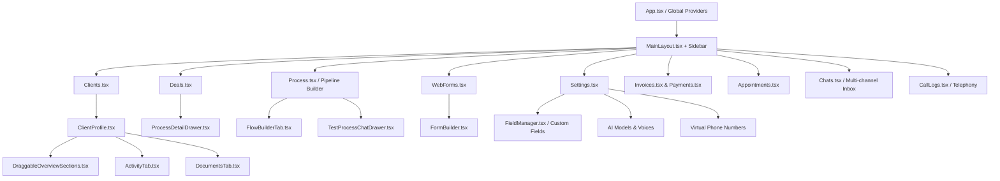

# MantraCare AI Healthcare CRM & Operations Platform
## Architecture & Technical System Overview

---

## 1. Executive Summary & Tech Stack

This project is a high-performance **Healthcare & Clinical Operations AI CRM** built to manage client lifecycles, automated patient engagement pipelines, multi-channel AI telephonic receptionists, appointment scheduling, customizable webforms, invoicing, services catalog, and dynamic field architectures.

### Technology Stack
- **Framework**: React 18 with TypeScript (Vite bundler)
- **Styling**: Tailwind CSS, custom design tokens, Lucide React icons
- **Drag & Drop**: Native HTML5 Drag & Drop + React DnD (`react-dnd` + `react-dnd-html5-backend`) with single top-level root backend
- **Animations**: Framer Motion (`motion/react`)
- **Routing**: React Router v6 / v7 (`createBrowserRouter`)
- **State Management**: React Context API, custom localStorage/sessionStorage reactive stores with cross-tab custom event dispatchers
- **Notifications**: Sonner toasts

---

## 2. Global Providers & Context Hierarchy

All global contexts wrap the application in [src/app/App.tsx](file:///c:/Users/Mantra/.gemini/antigravity/scratch/ma-figma/src/app/App.tsx):

```
ErrorBoundary
 └── ThemeProvider (Dark / Light theme, custom color accents)
      └── AuthProvider (User session, roles, active organization)
           └── SidebarProvider (Collapsible navigation, responsive drawers)
                └── OrganizationProvider (Multi-tenant org switching)
                     └── HowItWorksProvider (Interactive guided walkthroughs)
                          └── AIProviderProvider (OpenAI, Anthropic, ElevenLabs, Deepgram voice configs)
                               └── FieldRegistryProvider (Universal Custom Field Registry)
                                    └── ClientFieldsProvider (Client-specific field schemas)
                                         └── InvoiceProvider (Invoices, line items, payment processing)
                                              └── DndProvider (Global HTML5 Backend for Drag & Drop)
                                                   └── RouterProvider (Route views & nested drawers)
```

---

## 3. Core Modules & Page Architecture



### Module Breakdown

### 1. Clients & Client Profile (`/clients`, `/clients/:id`)
- **[Clients.tsx](file:///c:/Users/Mantra/.gemini/antigravity/scratch/ma-figma/src/app/pages/Clients.tsx)**: Main contacts directory table with search, dynamic column filters, batch actions, tag management, and CSV export/import.
- **[ClientProfile.tsx](file:///c:/Users/Mantra/.gemini/antigravity/scratch/ma-figma/src/app/pages/ClientProfile.tsx)**: Deep-dive profile drawer/page:
  - **Overview Tab**: Powered by [DraggableOverviewSections.tsx](file:///c:/Users/Mantra/.gemini/antigravity/scratch/ma-figma/src/app/components/profile/DraggableOverviewSections.tsx) allowing customizable, draggable sections, inline editing, and instant auto-saving.
  - **Activity Tab**: Unified timeline of calls, SMS, WhatsApp, stage migrations, forms, and appointments.
  - **Processes Tab**: Shows assigned pipelines, stage progressions, and active workflow step statuses.
  - **Documents Tab**: Uploaded PDFs, clinical charts, intake records, and identity files.
  - **Invoices Tab**: Client billing history, invoice generation, payment status.

### 2. Deals & Process Management (`/deals`)
- **[Deals.tsx](file:///c:/Users/Mantra/.gemini/antigravity/scratch/ma-figma/src/app/pages/Deals.tsx)**: Kanban pipeline and tabular process tracking.
- **[ProcessDetailDrawer.tsx](file:///c:/Users/Mantra/.gemini/antigravity/scratch/ma-figma/src/app/components/deals/ProcessDetailDrawer.tsx)**: 2-column split view with process metadata, stage stepper ribbons, quick activity poster, live document badges, and full activity stream.

### 3. Process Builder & Automation Engine (`/process`)
- **[Process.tsx](file:///c:/Users/Mantra/.gemini/antigravity/scratch/ma-figma/src/app/pages/Process.tsx)**: Visual workflow and pipeline creator:
  - **Stages Management**: Add/reorder/edit process stages.
  - **Trigger Steps**: "On Stage Entry", "In Call" (live speech-intent actions), "In Chat", and "Post Call" automations.
  - **Interactive Chat Simulator**: [TestProcessChatDrawer.tsx](file:///c:/Users/Mantra/.gemini/antigravity/scratch/ma-figma/src/app/components/process/TestProcessChatDrawer.tsx) to test AI bots against mock clients with real-time state mutation.

### 4. WebForms & Dynamic Form Builder (`/web-forms`, `/web-forms/builder`)
- **[WebForms.tsx](file:///c:/Users/Mantra/.gemini/antigravity/scratch/ma-figma/src/app/pages/WebForms.tsx)**: Forms library with submission counts, conversion metrics, and direct links.
- **[FormBuilder.tsx](file:///c:/Users/Mantra/.gemini/antigravity/scratch/ma-figma/src/app/pages/FormBuilder.tsx)**: Drag-and-drop form creator with universal registry integration (pulling fields directly from Client, Process, Appointment, Organization modules).

### 5. Telephony & Call Logs (`/call-logs`, `/call-logs/:id`)
- **[CallLogs.tsx](file:///c:/Users/Mantra/.gemini/antigravity/scratch/ma-figma/src/app/pages/CallLogs.tsx)**: Real-time incoming and outgoing AI calls, recordings, transcripts, duration analytics, sentiment indicators, and linked client profiles.
- **[CallDetailDrawer.tsx](file:///c:/Users/Mantra/.gemini/antigravity/scratch/ma-figma/src/app/components/telephony/CallDetailDrawer.tsx)**: Audio playback player, synchronized conversational transcription, and call variables.

### 6. Appointments & Scheduling (`/appointments`)
- **[Appointments.tsx](file:///c:/Users/Mantra/.gemini/antigravity/scratch/ma-figma/src/app/pages/Appointments.tsx)**: Calendar, week/day timeline view, slot booker, doctor/provider assignment, status lifecycle (Scheduled, Confirmed, Completed, Cancelled).
- **[ScheduleAppointmentDrawer.tsx](file:///c:/Users/Mantra/.gemini/antigravity/scratch/ma-figma/src/app/components/appointments/ScheduleAppointmentDrawer.tsx)**: Slide-out appointment creator with conflict check and email/SMS confirmation triggers.

### 7. Multi-Channel Inbox (`/chats`)
- **[Chats.tsx](file:///c:/Users/Mantra/.gemini/antigravity/scratch/ma-figma/src/app/pages/Chats.tsx)**: Unified conversations inbox supporting WhatsApp, SMS, and Website live chat widgets with bot handover to human agents.

### 8. Billing, Invoices & Payments (`/invoices`, `/payments`, `/transactions`)
- **[Invoices.tsx](file:///c:/Users/Mantra/.gemini/antigravity/scratch/ma-figma/src/app/pages/Invoices.tsx)** & **[Payments.tsx](file:///c:/Users/Mantra/.gemini/antigravity/scratch/ma-figma/src/app/pages/Payments.tsx)**: Multi-currency billing, custom line items, tax rates, payment links, manual payments, and PDF generation.

### 9. Settings, Custom Fields & Roles (`/settings`)
- **[Settings.tsx](file:///c:/Users/Mantra/.gemini/antigravity/scratch/ma-figma/src/app/pages/Settings.tsx)**:
  - **AI Models & Voices**: ElevenLabs / OpenAI TTS voice tuning, model parameters.
  - **Phone Numbers**: Twilio / Telnyx virtual number allocation & process routing.
  - **Universal Custom Fields**: Full field registry management across all system entities.
  - **Team & Permissions**: Granular role-based access control (RBAC).

---

## 4. Cross-Cutting State & Data Stores

The platform utilizes reactive in-memory stores backed by `localStorage` / `sessionStorage` with custom `EventTarget` dispatchers for instant synchronization across tabs and drawers:

| Store / Service | File Path | Description |
|---|---|---|
| **Field Registry** | `src/app/context/FieldRegistryContext.tsx` | Central catalog of system & custom fields across all modules (`client`, `process`, `appointment`, `call`, `service`, `organization`, `teamMember`). |
| **Activity Engine** | `src/lib/activityEngine.ts` | Event publisher-subscriber for client timeline entries, logs, stage updates, and webhook actions. |
| **Process Store** | `src/lib/useProcessStore.ts` | Stores active pipelines, stages, and stage number routing logic. |
| **Process Logs Store** | `src/lib/processLogsStore.ts` | Stores call logs, parent-child call links, recordings, and transcripts. |
| **Client Process State** | `src/lib/clientProcessState.ts` | Real-time state store syncing client current stages, assignments, and tags. |
| **Client Documents** | `src/lib/clientDocumentsStore.ts` | Document catalog, attachments, and verification status. |
| **Invoice Context** | `src/app/context/InvoiceContext.tsx` | In-memory invoice generator, transaction ledger, and payment tracking. |
| **Bot Runtime Engine** | `src/lib/conversationBotRuntime.ts` | Evaluates conversation flow nodes, conditional branching, and variable extractions. |

---

## 5. Key Design Principles & UX Patterns

1. **Auto-Saving**: Real-time auto-persistence on field updates, section adjustments, and stage movements without intrusive confirmation dialogues.
2. **Draggable & Modular Overview**: Flexible overview layouts with reorderable sections, drag-and-drop fields, and on-the-fly custom section creation.
3. **Deep Universal Field Linking**: Every custom field registered under `FieldRegistry` is immediately accessible across Client Profiles, Deals, Process Drawers, Form Builder, and Webhooks.
4. **Resilient Drag-and-Drop Architecture**: Root-level `DndProvider` eliminates multiple backend collision errors during Framer Motion animated route transitions.
