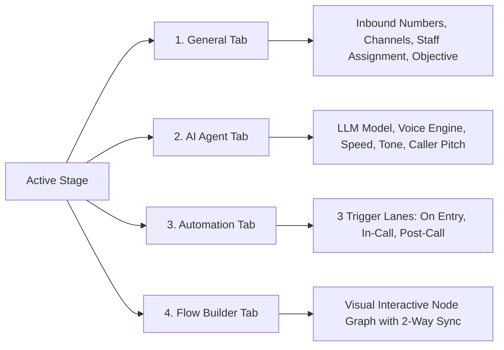
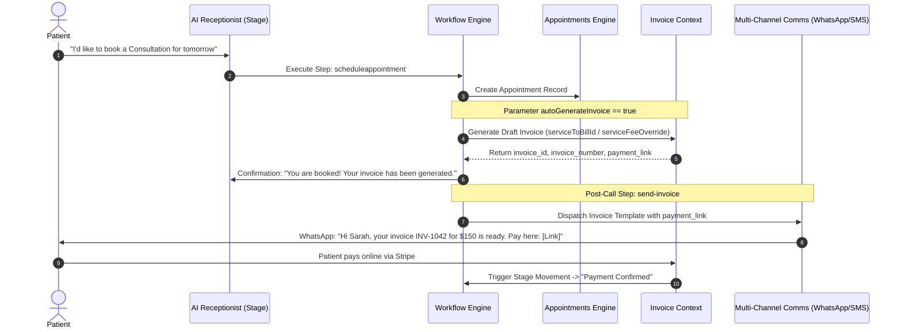
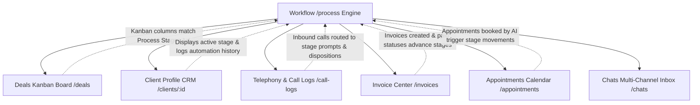

# Workflow & Automation Architectural Context & Technical Blueprint
## MantraCare AI Healthcare Operations & Clinical CRM Platform

---

## 1. Executive Summary & Architectural Role

In the **MantraCare** platform, the **Workflow System** (accessible via the sidebar under `CUSTOMIZATIONS > Workflows` at route `/process`) serves as the central **state machine, conversational brain, and automation coordinator** for the entire clinic.

Rather than being an isolated configuration page, `/process` defines:
1. **Patient Lifecycle Milestones (Stages)**: Where a patient or inquiry sits in the practice journey (e.g., *Inquiry Received*, *Consultation Scheduled*, *Invoiced & Awaiting Payment*, *Post-Care Follow-up*).
2. **AI Receptionist Behavioral Personas**: What LLM model, voice speed, vocal tone, and clinical prompts guide the AI receptionist when talking to a patient at each stage.
3. **Multi-Channel Automation Triggers**: How actions execute automatically across **Calls, SMS, WhatsApp, Invoices, and Appointments** when a contact enters a stage, during a live call, or after a call finishes.
4. **Visual Automation Graphs (Flow Builder)**: Node-based visual representation of execution steps, conditions, delays, and decision branches.

---

## 2. Component & File Map

The Workflow and Automation subsystem is organized across the following core files and directories:

```
src/
├── app/
│   ├── pages/
│   │   ├── Process.tsx                      # Client Portal: Primary Workflow & Automation Builder
│   │   ├── Deals.tsx                        # Patient Pipeline Kanban (Directly mirrors Process Stages)
│   │   ├── Chats.tsx                        # Multi-channel simulator & inbox for automation messages
│   │   ├── ClientProfile.tsx                # Patient record showing active workflow stage & automation activity
│   │   └── admin/
│   │       ├── AdminProcessTemplates.tsx    # Super Admin: Global Process Templates & Industry Scoping
│   │       └── components/
│   │           └── AdminScopingRulesEditor.tsx # Scoping editor for verticals, categories & locations
│   │
│   ├── components/
│   │   └── process/
│   │       ├── FlowBuilderTab.tsx           # Drag-and-drop node graph canvas & bidirectional sync engine
│   │       ├── StepParametersFields.tsx     # Granular parameter forms for every automation step type
│   │       ├── StepDetailDrawer.tsx         # Slide-out drawer to configure step name, delay & mode
│   │       ├── CallTriggerDrawer.tsx        # Outbound call scheduling, calling hours, timezones & retries
│   │       ├── TestProcessChatDrawer.tsx    # Live simulation drawer testing in-call & post-call automations
│   │       ├── VariablePickerButton.tsx     # Dynamic CRM & System variable insertion button
│   │       ├── VariableSelectorModal.tsx    # Variable picker modal with field search
│   │       └── ProcessTemplatePreviewDrawer.tsx # Drawer to inspect and import workflow templates
│   │
│   ├── context/
│   │   ├── ProcessTemplateContext.tsx       # Global state for process templates & active workflows
│   │   ├── InvoiceContext.tsx               # Invoice generation & billing state triggered by workflows
│   │   ├── AIProviderContext.tsx            # API provider credentials for OpenAI, Anthropic, ElevenLabs
│   │   └── FieldRegistryContext.tsx         # Custom fields scoped to processes & stages
│   │
│   └── types/
│       └── workflow.ts                      # Core TypeScript definitions for workflow steps & nodes
│
└── lib/
    ├── useProcessStore.ts                   # Core persistence, stage routing, transition logic & permissions
    ├── aiModelsStore.ts                     # AI LLM models catalog (OpenAI, Anthropic, DeepSeek, etc.)
    ├── useVoiceStore.ts                     # AI Voice library (ElevenLabs, Deepgram, accents, genders)
    ├── servicesStore.ts                     # Fee schedule catalog used for appointment billing
    ├── useStageNumberRouting.ts             # Inbound phone number to stage allocation
    ├── useWhatsappTemplates.ts              # WhatsApp template library for messaging automations
    └── processChatSimulator.ts              # Chat simulation engine parsing workflow automation responses
```

---

## 3. Core Data Entities & TypeScript Interfaces

### 3.1 Process Entity (`src/lib/useProcessStore.ts`)
A `Process` represents a complete end-to-end pipeline (e.g. *"General Medical Intake"*, *"Dental Implant Consultation"*, *"Post-Op Physical Therapy"*):

```typescript
export interface Process {
  id: string;
  name: string;
  description: string;
  assignedToUserId: number;
  stages: Stage[];
  aiSettings: AISettings;
  // Governance & Scoping
  industryCategory?: string;    // e.g. "Healthcare", "Dental", "Household Care"
  industry?: string;            // e.g. "General Practice", "Orthodontics"
  locations?: string[];         // e.g. ["US-CA", "US-NY"]
  scopingRules?: ScopingRule[]; // Fine-grained multi-location & vertical rules
  permissions?: ProcessPermissions; // canEdit, canAdd, canHide, canDelete
  source?: "system" | "template" | "custom";
}
```

### 3.2 Stage Entity
A `Stage` is an individual step within a process:

```typescript
export interface Stage {
  id: string;
  name: string;
  description: string;
  status: string;
  color?: string;
  stagePosition?: "initial" | "intermediate" | "final" | null;
  
  // AI Persona Configuration
  aiSettings?: {
    platform: string;     // e.g. "OpenAI", "Anthropic"
    voiceSpeed: number;   // 0.5x to 2.0x (default 1.0x)
    voice?: string;       // e.g. "Nova", "Perseus"
    tone?: string;        // e.g. "Professional", "Empathetic"
    style?: string;       // e.g. "Conversational", "Direct"
  };

  // Ingress & Telephony
  stageType?: string;
  selectedInboundNumbers?: string[]; // Phone numbers that route directly to this stage
  selectedStageChannels?: string[];  // ["calls", "sms", "whatsapp", "website"]
  responsiblePerson?: string;
  callerPitch?: string;              // Master system prompt / script for the AI
  
  // Outbound Calling Rules
  enableCalling?: boolean;
  callTriggerSettings?: CallTriggerSettings; // Calling hours, retry rules, skip days

  // Automations & Flow Nodes
  workflowSteps?: WorkflowStep[];
  
  // Transitions
  nextProcessTransitions?: ProcessTransitionTarget[];
}
```

### 3.3 Workflow Step Entity (`src/app/types/workflow.ts`)
An automation action attached to a stage:

```typescript
export interface WorkflowStep {
  id: string;
  name: string;
  description: string;
  iconKey: string;
  stepKey: string;              // Identifier of the automation action type
  trigger?: "onentry" | "incall" | "postcall"; // Which lane executes this step
  executionMode?: "sequential" | "parallel";
  delayValue?: number;          // e.g. 5
  delayUnit?: "minutes" | "hours" | "days";
  params?: Record<string, any>; // Action-specific payload (see Section 6 & 7)
}
```

---

## 4. How the Client Workflow Page (`/process`) Works

The `/process` route is built with a dual-pane layout:
- **Left Sidebar / Process Selector**: Displays the list of available processes for the active organization. Users can switch processes, create new custom processes, duplicate existing templates, or delete processes.
- **Main Canvas**: Divided into the **Stages Pipeline View** and the **Active Stage Details Inspector**.

### 4.1 Stage Pipeline Overview
At the top of the process canvas, stages are rendered as visual cards in sequence:
- Re-orderable using HTML5 drag-and-drop.
- Each stage pill displays its color badge, name, inbound phone numbers count, and active automations count.
- Clicking any stage opens the **Stage Details Inspector** below with 4 dedicated tabs.

### 4.2 The Four Stage Detail Tabs



#### Tab 1: General
- **Stage Metadata**: Name, description, status label, and color picker.
- **Inbound Numbers Routing**: Uses `assignNumberToStage` to link specific virtual phone numbers (Twilio/Telnyx) to this stage. When a caller dials that number, the call starts directly at this stage.
- **Channel Ingress**: Toggles which channels (`Calls`, `SMS`, `WhatsApp`, `Website Chat`) feed into this stage.
- **Responsible Person**: Staff member assigned to oversee contacts in this stage.
- **Caller Pitch / Script**: The prompt provided to the AI agent during interactions in this stage.

#### Tab 2: AI Agent
- **AI Model Selection**: Dropdown powered by `getActiveAIModels()` (`aiModelsStore.ts`) featuring GPT-4o, Claude 3.5 Sonnet, DeepSeek V4, etc. Includes the shortcut option `"Choose from library →"` which navigates to the Voice/Model settings.
- **Speech Speed Slider**: 0.5x (Slow) to 1.5x (Fast) with 1.0x marked as Natural.
- **Voice Engine**: Dropdown powered by `useVoiceStore` featuring ElevenLabs and Deepgram neural voices (Nova, Perseus, Orion, etc.) with preview playback and `"Choose from library →"` shortcut.
- **Tone & Style**: Configures whether the voice sounds Professional, Friendly, Empathetic, or Clinical.

#### Tab 3: Automation Tab (The Tri-Lane Automation Engine)
Automations are organized into three distinct execution lanes:
1. **On Stage Entry**:
   - Executes the moment a contact arrives in this stage (e.g. Send Welcome SMS, alert staff, schedule outbound call).
   - Supports execution delays (e.g. *"Wait 10 minutes before sending"*).
2. **In Call (Live)**:
   - Executes during an active conversation between the AI receptionist and the caller.
   - Evaluates caller intent or field criteria (e.g., Transfer call if caller asks for human doctor, check calendar availability, play idle prompt).
3. **Post Call**:
   - Executes immediately after the telephone call disconnects.
   - Ideal for dispatching appointment confirmations, SMS summaries, generating invoices, or transitioning the patient to the next stage.

#### Tab 4: Flow Builder Tab (`FlowBuilderTab.tsx`)
- Provides a node-based flowchart canvas.
- Renders:
  - `start` node representing the stage trigger.
  - `wait` delay timer nodes.
  - `condition` logic decision gates.
  - `action` nodes for each automation step.
  - `parallel` branching groups.
- **2-Way Synchronization**: Any step added or modified in the Automation tab is instantly converted into nodes in the Flow Builder, and changes made on the canvas update the underlying stage's `workflowSteps` array.

---

## 5. Comprehensive Automation Steps Catalog

Below are all automation steps supported in `StepParametersFields.tsx` and `Process.tsx`:

| Category | Step Key | Name | Description | Key Parameters |
|---|---|---|---|---|
| **Workflow Logic** | `processmovement` / `movetonewprocess` | Assign / Move Process | Moves contact to a specific process and stage | `stepDetailProcess`, `stepDetailStage`, `stepEndCurrentProcess` |
| | `endworkflow` | End Workflow | Terminates the pipeline and marks contact completed | - |
| **Caller Engagement** | `callaction` | Transfer Call | Transfers live call to a phone number or staff member | `transferPhoneNumber`, `transferCountryCode`, `transferReason` |
| | `callhangup` | Auto Hangup | Ends the active call with closing audio prompt | `hangupPrompt`, `hangupReason` |
| | `idlemessages` | Idle Messages | Prompts AI when caller is silent for N seconds | `idleTimeoutSeconds`, `idlePrompts` |
| **Communication** | `whatsapp` | WhatsApp Message | Sends WhatsApp message via pre-approved template | `templateId`, `variablesMap`, `campaignId` |
| | `sms` | SMS Message | Sends SMS text notification | `smsMessage`, `fromPhoneNumber` |
| | `email` | Email Notification | Dispatches email notification | `emailSubject`, `emailBodyHtml`, `replyTo` |
| | `send-invoice` | **Send Invoice** | Dispatches invoice payment link to patient | `invoiceChannel` (`whatsapp` \| `sms` \| `email`) |
| **Data & CRM** | `fieldupdate` | Field Update | Updates custom or system field on patient record | `targetField`, `newValue`, `operation` |
| | `assignhuman` | Assign to Human | Reassigns responsible team member | `assignedEmployeeId` |
| | `collectinformation` | Collect Form Data | Presents digital intake questionnaire | `collectInfoSelectedForm` |
| **Scheduling** | `scheduleappointment` / `managecalendar` | **Schedule Appointment** | Books, reschedules, or cancels calendar appointments | `appointmentBookingMethod`, `calendarMode`, `autoGenerateInvoice`, `serviceToBillId` |
| | `fetchavailability` | Fetch Availability | Checks real-time calendar availability during call | `fetchAvailCalendarUser`, `fetchAvailDateSource` |
| **Integrations** | `webhook_trigger` | Webhook Automation | POSTs payload to third-party webhook URL | `webhookUrl`, `headers`, `payloadFormat` |
| | `wh_trigger` | API Automation | Executes predefined external REST API integration | `apiIntegrationId`, `queryParams` |

---

## 6. Deep Dive: Appointment Scheduling Integration

Workflows handle appointment management autonomously during phone calls and chat conversations.

### 6.1 Booking Methods Supported
When configuring the `scheduleappointment` step:
1. **Text Booking Link (`text-link`)**: The AI sends a personalized link to the patient via SMS or WhatsApp to complete their booking online.
2. **Collect Booking Request (`collect-request`)**: The AI gathers the patient's requested date, time, and service, saving it as a pending request for clinic staff review.
3. **Schedule Over Phone (`schedule-phone`)**: The AI checks live calendar slots via `fetchavailability` and books the session directly into the provider's calendar.

### 6.2 Managing Calendar Steps (`managecalendar`)
Supports three operational modes:
- **`book`**: Creates a new appointment entry in `Appointments.tsx`.
- **`reschedule`**: Modifies the start/end time of an existing meeting ID.
- **`cancel`**: Releases the booked slot and marks the appointment status as cancelled.

---

## 7. Deep Dive: Medical Invoicing & Billing Integration

The Workflow engine features built-in billing automation, closing the loop between scheduling a service and collecting revenue.



### 7.1 Auto-Generate Invoice on Booking
In `StepParametersFields.tsx`, the `scheduleappointment` step includes the **Auto-generate invoice on booking** toggle:
- `autoGenerateInvoice: boolean` (default: `true`)
- When enabled, the workflow engine automatically accesses `servicesStore.ts` to fetch:
  - `serviceToBillId`: The selected procedure from the practice catalog (e.g., *Consultation*, *Cleaning*, *Therapy Session*).
  - `serviceFeeOverride`: An optional flat numeric override (e.g., $150.00 instead of standard catalog price).
- When the appointment is confirmed, the invoice is instantiated in `InvoiceContext.tsx` with:
  - Unique invoice number (e.g. `INV-2026-089`).
  - Associated patient / client details.
  - Linked appointment date and service line items.
  - Balance due status: `unpaid`.

### 7.2 Send Invoice Automation Step (`send-invoice`)
Configured to execute immediately on stage entry or post-call:
- **Delivery Channel**: `whatsapp`, `sms`, or `email`.
- **Message Template**: Pre-formatted message injecting dynamic tokens:
  - `{{contact_name}}`: Patient name.
  - `{{invoice_number}}`: Auto-generated invoice number.
  - `{{invoice_amount}}`: Formatted currency amount (e.g. `$150.00`).
  - `{{due_date}}`: Payment due date.
  - `{{payment_link}}`: One-click checkout URL directing the patient to payment processing.

---

## 8. Cross-Domain Dependencies & Architectural Matrix

### 8.1 Upstream Dependencies (What Workflow Requires to Run)

| Upstream Dependency | File / Store | Purpose in Workflow |
|---|---|---|
| **AI Models Catalog** | `src/lib/aiModelsStore.ts` | Populates active LLM options in Stage > AI Agent tab |
| **Voice Persona Catalog** | `src/lib/useVoiceStore.ts` | Neural voice selection & audio sample preview playback |
| **Services & Fee Catalog** | `src/lib/servicesStore.ts` | Feeds service procedures and base prices to invoice automations |
| **Telephony DID Inventory** | `src/lib/useStageNumberRouting.ts` | Maps real virtual telephone numbers to stage entry points |
| **Meta WhatsApp Templates** | `src/lib/useWhatsappTemplates.ts` | Validates templates available for `whatsapp` automation steps |
| **Custom Field Registry** | `src/app/context/FieldRegistryContext.tsx` | Provides field tokens for variable picker & field update steps |
| **Tenant Organization** | `src/app/context/OrganizationContext.tsx` | Scopes processes, stages, and data isolation per clinic |

### 8.2 Downstream Dependencies (What Relies on Workflow)



1. **Deals & Patient Pipelines (`src/app/pages/Deals.tsx`)**:
   - The Deals Kanban columns are dynamically generated from the stages of the active process.
   - Dragging a patient deal card across columns triggers the stage transition event, running all `onentry` automations.
2. **Client Profiles (`src/app/pages/ClientProfile.tsx`)**:
   - The patient overview displays their current active process and stage.
   - The Activity Timeline (`src/lib/activityEngine.ts`) records each executed automation step (e.g., *"Pipeline Automation: WhatsApp Sent"*, *"Auto-generated Invoice INV-102"*).
3. **Telephony & Call Logs (`src/app/pages/CallLogs.tsx`)**:
   - Inbound calls look up the assigned stage for the dialed number via `assignNumberToStage`.
   - Call transcripts are analyzed for intent triggers, automatically moving the patient to the matching stage (e.g. *Interested* vs *Disqualified*).
4. **Appointments (`src/app/pages/Appointments.tsx`)**:
   - Appointment creation events check if a workflow transition rule applies (e.g. moving a lead from *Follow-up* to *Booked*).

---

## 9. How Super Admin Works (`AdminProcessTemplates.tsx`)

In addition to clinic-level workflows, the platform provides **Super Admin Template Governance** via `AdminProcessTemplates.tsx` (route `/admin/process-templates`):

### 9.1 Purpose of Admin Process Templates
Super Admins configure master blueprints that are distributed to clinics based on industry and location:
- Healthcare General Clinics
- Dental Practices & Orthodontics
- Behavioral Health & Psychiatry
- MedSpa & Aesthetics
- Home Healthcare Services

### 9.2 Industry & Jurisdiction Scoping (`AdminScopingRulesEditor.tsx`)
Each master template defines scoping rules using `isProcessMatchingScope()`:
- **Industry Categories**: `INITIAL_CATEGORIES` (e.g., *Healthcare*, *Wellness*, *Professional Services*).
- **Sub-Industries**: `INITIAL_INDUSTRIES` (e.g., *Cardiology*, *Pediatrics*, *Physical Therapy*).
- **Geographic Jurisdictions**: `STANDARD_LOCATIONS` (e.g., *California (US-CA)*, *Texas (US-TX)*).
When a new clinic signs up, the system evaluates their profile and automatically clones the appropriate master workflow template into their workspace.

### 9.3 Tenant Permissions Matrix (`ProcessPermissions`)
Super Admins can lock or unlock specific components of a template:
- `canEdit`: Determines if clinic staff can alter prompts, voices, or step parameters.
- `canAdd`: Controls whether clinics can insert new stages into the workflow.
- `canHide`: Allows or prevents clinics from hiding system-mandated compliance stages.
- `canDelete`: Protects critical clinical stages from accidental deletion.

---

## 10. Live Testing & Simulation (`TestProcessChatDrawer.tsx`)

To ensure reliability before deploying workflows live, `/process` provides the **Test Process** drawer:
- **Interactive Chat & Voice Tester**: Simulates how the AI receptionist behaves at each stage.
- **Trigger Execution Simulation**:
  - Simulates stage entry events.
  - Tests in-call actions (e.g. simulating a caller asking *"Can I speak to someone?"* triggers the `callaction` transfer step).
  - Simulates post-call hand-offs, appointment slot reservation, and invoice dispatching.
- **Dry-Run Inspection**: Logs the exact payload, variable values, and mock delivery status without sending real SMS or making actual phone calls.

---

## 11. Summary Checklist for Engineers & Product Teams

- [x] **Route**: `/process` is titled **Workflow** (formerly Process Settings) and categorized under `CUSTOMIZATIONS`.
- [x] **Dropdowns**: AI Voice and AI Model dropdowns provide `"Choose from library →"` pointing to Voice/Model settings.
- [x] **Kanban Alignment**: Changes to stages in `/process` immediately reflect in `/deals` Kanban columns.
- [x] **Invoicing**: AI appointments support `autoGenerateInvoice` with automatic fee assignment and multi-channel delivery.
- [x] **2-Way Sync**: Automation tab steps and Flow Builder nodes remain in lockstep.
- [x] **Multi-Tenancy**: All workflows and active stage states are scoped by `OrganizationContext`.
