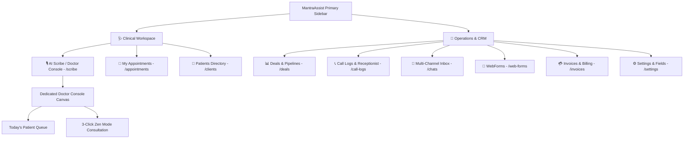
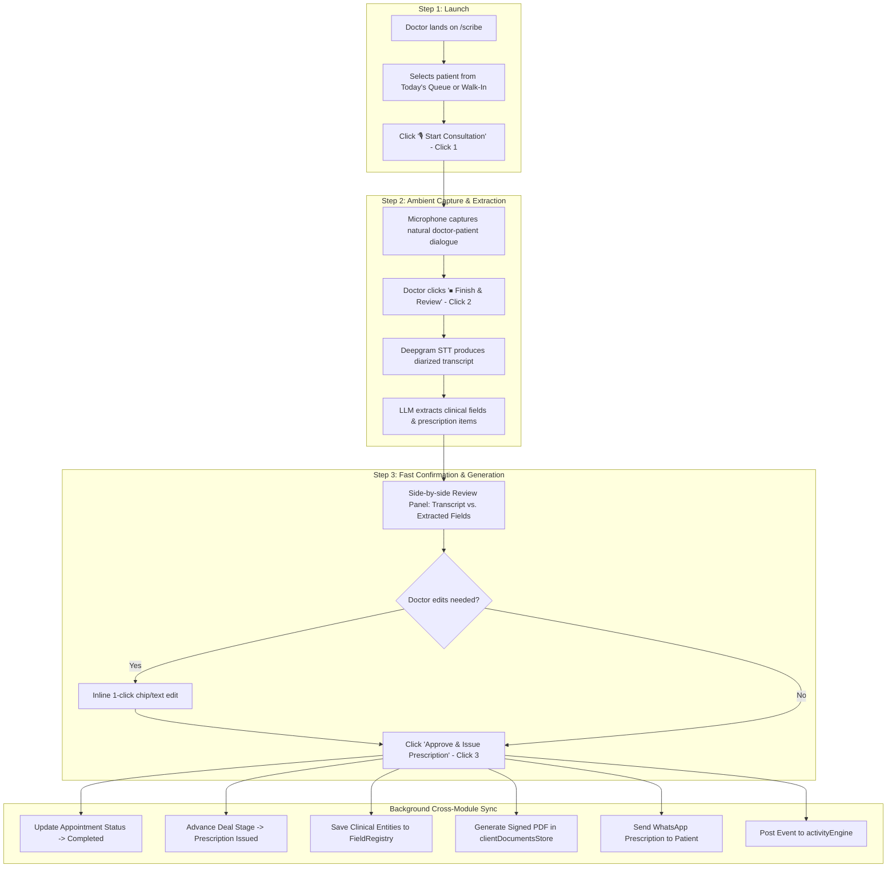
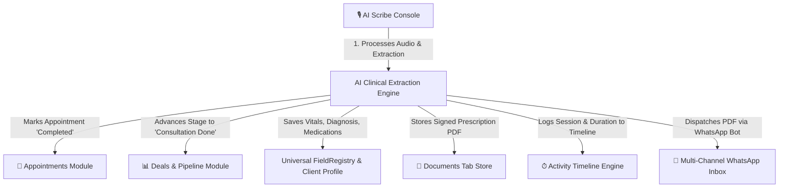
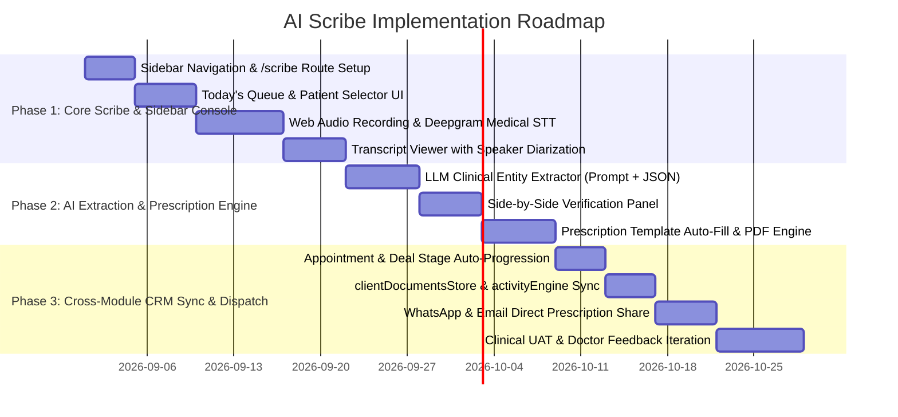

# AI Scribe — Product Requirements Document (PRD)

**Product**: MantraAssist AI Scribe (Clinical Documentation & Automated Prescription Engine)  
**Version**: 2.0  
**Author**: Navodya (Senior Product Management)  
**Status**: Ready for Engineering & Clinical Review  
**Date**: August 2026  

---

## 1. Executive Summary

**MantraAssist AI Scribe** is an ambient, voice-first clinical documentation and automated prescription engine designed specifically for healthcare providers, doctors, and clinical coordinators. 

While MantraAssist provides a robust suite of CRM tools (telephony, webforms, pipelines, invoices, and messaging), doctors need a **clean, focused, zero-cognitive-load workspace** that does not burden them with administrative complexity.

AI Scribe solves this by introducing:
1. **A Dedicated Doctor Console (`/scribe`)**: Accessible directly from the primary navigation sidebar, presenting today's patient queue, consultation launcher, and live clinical canvas.
2. **Ambient Consultation Recording & STT**: 1-click recording powered by Deepgram Nova-2 Medical STT with speaker diarization (`Doctor` vs. `Patient`).
3. **Automated Clinical Entity Extraction**: Real-time extraction of symptoms, diagnosis, vitals, medications, dosage, investigations, and follow-up dates mapped to the universal **FieldRegistry**.
4. **1-Click Prescription Generation & CRM Sync**: Auto-populates document templates (`documentTemplatesStore.ts`), generates verified PDF prescriptions, updates appointment & deal pipeline statuses, and dispatches prescriptions via WhatsApp.

---

## 2. Problem Statement & Doctor Experience Gap

### 2.1 The Doctor's Daily Workflow Today
- **High Patient Volume**: Doctors see 30–50 patients daily with only 5–10 minutes per consultation.
- **Administrative Drag**: Post-consultation data entry into Bitrix24/CRM takes 5–8 minutes per patient (accumulating 2.5–3+ hours of typing per day).
- **Disjointed Prescription Workflows**: Prescriptions are handwritten or typed separately in third-party software, then scanned or photographed.
- **CRM Overwhelm**: Doctors forced to navigate complex sales pipelines, webhook configurations, and invoicing tools to update simple medical notes.

### 2.2 The AI Scribe Solution
| Current Friction | With AI Scribe (Doctor Console) |
|---|---|
| Typing or scribbling notes while examining patients | Ambient recording captures natural conversation in the background |
| Navigating complex multi-stage CRM pipelines | Dedicated `/scribe` sidebar console with Today's Patient Queue |
| Manual prescription drafting and formatting | 1-click auto-fill of prescription templates from extracted voice data |
| Unfilled clinical fields in patient records | Automatic sync to `FieldRegistry` custom fields |
| Chasing front-desk staff to print & deliver prescriptions | Automated PDF generation + instant WhatsApp delivery to patient |

---

## 3. Information Architecture & Navigation Strategy

To keep the platform clean and uncluttered, MantraAssist employs a **Dual-Persona Sidebar Hierarchy**:

```
┌────────────────────────────────────────────────────────┐
│  MantraAssist                                          │
├────────────────────────────────────────────────────────┤
│  🩺 CLINICAL WORKSPACE                                 │
│  🎙 AI Scribe (Doctor Console)    ◄── Dedicated Route  │
│  📅 My Appointments                                    │
│  👥 Patients Directory                                 │
├────────────────────────────────────────────────────────┤
│  🏢 OPERATIONS & CRM (Collapsible for Doctors)         │
│  📊 Deals & Pipelines                                  │
│  📞 Telephony & Receptionist                           │
│  💬 Multi-Channel Inbox                                │
│  📝 WebForms                                           │
│  💳 Invoices & Billing                                 │
│  ⚙️ Settings & Custom Fields                           │
└────────────────────────────────────────────────────────┘
```

### 3.1 Sidebar & Route Architecture Diagram



---

## 4. The 3-Click "Doctor Zen Mode" Workflow

The AI Scribe Doctor Console provides a minimalist, high-speed interface where doctors can complete documentation in **3 clicks**:

```
┌────────────────────────────────────────────────────────────────────────────────────────┐
│ 🎙 AI Scribe • Dr. Priya Sharma                             Today: 24 Aug | 8 Patients │
├────────────────────────────────────────────────────────┬───────────────────────────────┤
│ TODAY'S PATIENT QUEUE                                  │ ACTIVE CONSULTATION CANVAS    │
│                                                        │                               │
│ [10:00 AM] Rajesh Kumar • Cataract Review              │ 👤 Rajesh Kumar (54 M)        │
│ ● In Waiting Room   [🎙 Start Consultation] ──Click 1  │ Allergies: Penicillin         │
│                                                        │ History: Type 2 Diabetes      │
│ [10:30 AM] Sunita Devi • Post-Op Checkup               │ ───────────────────────────── │
│ ○ Scheduled         [🎙 Start Consultation]            │ 🔴 Recording Consultation...  │
│                                                        │ [ ▃ ▅ █ ▇ ▅ ▃ █ ▅ 04:12 ]     │
│ [11:00 AM] Amit Patel • First Visit                    │                               │
│ ○ Scheduled         [🎙 Start Consultation]            │ [ ⏸ Pause ] [ ⏹ Finish & Review ]│
│                                                        │                  ▲ Click 2    │
│ [+ Walk-in Patient]                                    │                               │
└────────────────────────────────────────────────────────┴───────────────────────────────┘
```

### 4.1 Step-by-Step Flow



---

## 5. Cross-Module CRM Synchronization Matrix

AI Scribe acts as the **intelligent clinical engine** that updates all other CRM modules in the background without manual data entry:



### Detailed Cross-Module Sync Specifications

| MantraAssist Module | Integration Point | Automated Background Action |
|---|---|---|
| **Appointments (`/appointments`)** | `AppointmentsContext` / API | • Displays upcoming patients in Scribe Queue.<br>• Sets status to `In Consultation` when recording starts.<br>• Sets status to `Completed` upon prescription sign-off. |
| **Deals & Pipelines (`/deals`)** | `clientProcessState.ts` / `useProcessStore.ts` | • Automatically moves patient card from *Counseling* → *Consultation Completed* / *Surgery Advised* without doctor touching the Kanban board. |
| **Custom Fields (`FieldRegistryContext`)** | `FieldRegistryContext.tsx` | • Populates structured clinical fields (`chief_complaint`, `diagnosis`, `prescribed_medicines`, `dosage`, `investigations`, `follow_up_date`) directly into client profile. |
| **Document Templates (`documentTemplatesStore`)** | `documentTemplatesStore.ts` & `pdfGenerator.ts` | • Selects prescription/clinical summary template, substitutes `{variable}` tokens, generates high-res PDF with clinic letterhead and digital doctor signature. |
| **Client Documents (`clientDocumentsStore`)** | `clientDocumentsStore.ts` | • Saves generated PDF under category `Medical / Intake` tagged as `Verified` & `AI Scribe Generated`. |
| **Activity Timeline (`activityEngine`)** | `activityEngine.ts` | • Appends consultation record: *"AI Scribe consultation (06:30 mins) completed by Dr. Sharma. Prescription #RX-8842 issued."* |
| **Messaging & WhatsApp (`/chats`)** | `useWhatsAppNumbers.ts` | • Dispatches automated WhatsApp notification to patient with clickable prescription download link. |

---

## 6. Functional & UI Component Specifications

### 6.1 Scribe Doctor Console (`src/app/pages/AIScribeConsole.tsx`)
- **Queue Panel (Left 35%)**:
  - Filter tabs: `Today's Queue` | `Completed (4)` | `All Patients`.
  - Patient card: Patient Name, Age/Gender, Appointment Time, Chief Complaint, Status Pill (`In Waiting Room`, `In Consultation`, `Completed`).
  - Search bar with instant patient lookup + `+ Walk-in Patient` button.
- **Active Consultation Canvas (Right 65%)**:
  - Patient Header Card: Demographics, Known Allergies (highlighted in red), Medical History tags.
  - Recording Control Bar: Ambient pulsing beacon (`#ef4444`), waveform visualizer, duration timer (`font-mono`), Pause/Resume, and Finish button.

### 6.2 Scribe Modal for Existing Pages (`src/app/components/scribe/AIScribeModal.tsx`)
- In addition to the dedicated page, the Scribe modal is accessible via:
  - `ClientProfile.tsx`: Action bar pill button `🎙 Scribe`.
  - `ProcessDetailDrawer.tsx`: Header quick-action button.
  - `Appointments.tsx`: Row action `Start Scribe`.

### 6.3 Side-by-Side Review Panel (`src/app/components/scribe/FieldExtractionPanel.tsx`)
- **Left Pane (45%)**: Speaker-diarized transcript (`Dr.` in Navy, `Patient` in Slate). Clicking any phrase highlights its corresponding extracted field.
- **Right Pane (55%)**: Extracted clinical cards:
  - **Chief Complaint & Vitals**: Symptoms, BP, Pulse, Weight.
  - **Clinical Diagnosis**: Primary & Secondary conditions with confidence pills.
  - **Medications & Dosage**: Table format (Drug Name, Form, Dosage, Frequency, Duration, Instructions).
  - **Investigations & Plan**: Diagnostic tests ordered and follow-up date.

### 6.4 Prescription Preview & Dispatch (`src/app/components/scribe/DocumentGenerationPanel.tsx`)
- Live interactive A4 sheet preview with clinic letterhead.
- Auto-filled fields highlighted in subtle blue (`#eff6ff`).
- One-click actions:
  - `Approve & Sign PDF`
  - `Send to Patient WhatsApp`
  - `Print Prescription`

---

## 7. Data Models & TypeScript Schemas

### 7.1 Scribe Session Store (`src/lib/scribeSessionStore.ts`)

```ts
export interface ScribeUtterance {
  id: string;
  speaker: "doctor" | "patient" | "assistant";
  startTime: number;
  endTime: number;
  text: string;
  confidence: number;
}

export interface ExtractedMedication {
  id: string;
  drugName: string;
  dosage: string;           // e.g. "500 mg" / "0.5% drops"
  frequency: string;        // e.g. "1-0-1" / "TDS" / "Once daily"
  duration: string;         // e.g. "5 days"
  instructions: string;     // e.g. "After food"
  confidence: number;
}

export interface ExtractedClinicalData {
  chiefComplaint: string;
  vitals?: {
    bloodPressure?: string;
    pulse?: string;
    temperature?: string;
    weight?: string;
  };
  diagnosis: string;
  secondaryDiagnosis?: string[];
  medications: ExtractedMedication[];
  investigations: string[];
  followUpDate?: string;
  doctorNotes?: string;
}

export interface ScribeSession {
  id: string;
  clientId: string;
  clientName: string;
  appointmentId?: string;
  dealId?: string;
  doctorId: string;
  doctorName: string;
  sessionDate: string;
  durationSeconds: number;
  audioBlobUrl?: string;
  transcript: {
    fullText: string;
    utterances: ScribeUtterance[];
  };
  extractedData: ExtractedClinicalData;
  generatedDocumentId?: string;
  status: "recording" | "transcribed" | "extracted" | "completed" | "discarded";
  createdAt: number;
}
```

---

## 8. UX & Design System Compliance (`DESIGN_NAVODYA.md`)

All Scribe components adhere strictly to the unified **Navy-to-Slate, Electric Blue, Clinical Emerald, and Slate** palette:

| Element | Specification | Design Token |
|---|---|---|
| **Canvas & Containers** | Frosted glass card with 1px border and soft shadow | `bg-white/70 backdrop-blur-md border-[#e2e8f0] shadow-sm` |
| **Doctor Active Nav Pill** | Dark Navy-to-Slate gradient | `linear-gradient(135deg, #181e25 0%, #2c3e50 100%)` |
| **Primary Actions** | Pill button (`rounded-full`) with Navy gradient | `bg-gradient-to-r from-[#181e25] to-[#2c3e50] text-white shadow-md` |
| **Accent Action (Prescription)**| Pill button with Electric Blue | `bg-[#1456f0] hover:bg-[#2563eb] text-white shadow-md` |
| **Recording Beacon** | Pulsing Red beacon indicator | `bg-red-500 animate-ping` (recording status only) |
| **Verified Data Badge** | Clinical Emerald badge with check icon | `bg-emerald-50 text-emerald-700 border-emerald-200` |
| **Review Needed Badge** | Electric Blue badge | `bg-blue-50 text-blue-700 border-blue-200` |
| **Typography** | Headings in Outfit, body in DM Sans, IDs & Timestamps in JetBrains Mono | `font-display`, `font-sans`, `font-mono tabular-nums` |

---

## 9. Phased Implementation Roadmap



---

## 10. Success Metrics (KPIs)

1. **Doctor Consultation Admin Time**: Reduced from **8–12 minutes** to **< 90 seconds** per patient.
2. **Prescription Error Rate**: **< 0.5%** with side-by-side human confirmation before signing.
3. **Custom Field Completeness**: Patient clinical field fill rate increased from **~28%** to **> 88%**.
4. **Doctor Adoption (WAC)**: >80% of consulting doctors actively use the Scribe console daily.
5. **Zero Context-Switching**: Doctors complete consultation, documentation, and prescription dispatch from a single screen.

---

## 11. Dual-Persona Architecture: Doctor View vs. Admin View & Transcripts Archive

To support both high-speed clinical execution and clinic-wide administrative governance, AI Scribe provides **two dedicated interface modes** and a centralized **Transcripts Archive**:

### 11.1 Doctor View (Clinical Mode)
* **Target Audience**: Consulting Physicians, Surgeons, Clinical Coordinators.
* **Core Philosophy**: Zero-cognitive-load, 3-click ambient consultation.
* **Tabs & Workflows**:
  * **🎙 Active Consultation & Queue**: Today's patient list filtered by department/room, 1-click ambient recording, real-time waveform, speaker diarization (`Doctor` vs `Patient`), clinical entity extraction (Diagnosis, Rx, Vitals, Investigations), verified PDF prescription generation, and 1-click WhatsApp delivery.
  * **📋 My Transcripts & Past Records**: Dedicated history of all consultations conducted by the active clinician with searchable transcripts, audio playback scrubber, and instant re-download.

### 11.2 Admin View (Governance & Management Mode)
* **Target Audience**: Medical Directors, Clinic Administrators, Operations Leads.
* **Core Philosophy**: Telemetry, accuracy benchmarking, room distribution, and HIPAA compliance.
* **Tabs & Capabilities**:
  * **📊 Scribe Analytics & Adoption**: Executive KPI cards (Total consultations scribed, doctor hours saved, STT accuracy percentage, active clinicians), plus a live Doctor Utilization Matrix tracking per-physician volume and custom field completion.
  * **📋 Clinic Master Transcripts Archive**: Clinic-wide repository of all past consultations with multi-doctor filtering, keyword search across dialogues, and full speaker diarization modal with JSON/PDF export.
  * **👥 Doctor Queues & Rooms**: Multi-room OPD queue manager to add walk-in patients and balance queue loads across doctors.
  * **⚙️ AI STT & HIPAA Config**: Speech engine configuration (Deepgram Nova-2 Medical, Whisper Large v3, Google Healthcare STT), auto-WhatsApp dispatch toggle, FieldRegistry auto-sync toggle, and audio retention policy settings (30/90/365 days).
