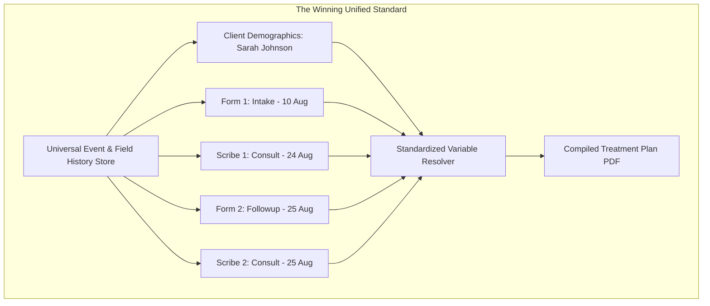
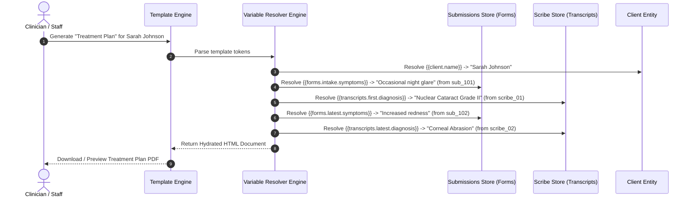

# Product Requirements & Architecture Standard:
# Document Templates & Multi-Event Data Variable Resolution

**Document Status:** Final Technical RFC & Architecture Standard  
**Focus:** Standardizing Document Generation (Treatment Plans, Progress Reports, Discharge Summaries) across Multi-Form & Multi-Transcript Data  
**Author:** Product & Engineering Architecture  
**Date:** August 25, 2026  

---

## 1. The Core Problem Re-framed: The Document Generation Lens

The ultimate downstream reason we must retain client history across multiple forms and consultations is **Document Template Generation** (e.g., **Treatment Plans, Longitudinal Progress Reports, Medical Certificates, Insurance Discharge Summaries**).

### The Real-World Scenario: Generating a Treatment Plan
A clinic generates a **Comprehensive Treatment Plan & Progress Report** for patient **Sarah Johnson**:

```
┌─────────────────────────────────────────────────────────────────────────────┐
│                       MANTRA CLINICAL TREATMENT PLAN                        │
│ Patient: Sarah Johnson (DOB: 14-May-1988)                 Date: 25 Aug 2026 │
├─────────────────────────────────────────────────────────────────────────────┤
│ 1. INITIAL ASSESSMENT (Intake Form — 10 Aug 2026)                           │
│    • Baseline Symptoms: "Occasional night glare, mild blurring"             │
│    • Reported Pain Level: 2 / 10                                            │
│                                                                             │
│ 2. FIRST CLINICAL CONSULTATION (AI Scribe — 24 Aug 2026)                    │
│    • Clinical Findings: "Nuclear Cataract Grade II (Right Eye)"              │
│    • Prescribed Regimen: Moxifloxacin Eye Drops 0.5%                        │
│                                                                             │
│ 3. PATIENT INTERIM UPDATE (Follow-up Check-in Form — 25 Aug 2026)           │
│    • Follow-up Symptoms: "Increased eye redness, sensitivity to light"      │
│    • Updated Pain Level: 5 / 10                                             │
│                                                                             │
│ 4. SECOND CLINICAL CONSULTATION (AI Scribe — 25 Aug 2026)                   │
│    • Updated Diagnosis: "Post-consultation corneal abrasion + Cataract"     │
│    • Revised Treatment Plan: Prednisolone acetate drops + eye shield        │
└─────────────────────────────────────────────────────────────────────────────┘
```

### Why the Current System Completely Fails This Use Case
In the current flat model, all forms and transcripts write to `client.symptoms` and `client.diagnosis`.
When the template engine attempts to compile the document using standard variables like `{{symptoms}}` and `{{diagnosis}}`:

- `{{symptoms}}` resolves **only** to `"Increased eye redness"` (the latest check-in). The baseline symptoms from August 10th are **destroyed and cannot be printed**.
- `{{diagnosis}}` resolves **only** to the second consultation. The initial cataract diagnosis is **lost**.
- **Result:** It is impossible to generate longitudinal treatment plans, contrast baseline vs follow-up symptoms, or audit clinical progression.

---

## 2. Which Solution Solves Document Templating?

Let's evaluate the 3 options specifically on their ability to solve **Document Template Creation**:



### Evaluation of Options from the Document Generation Lens:

| Approach | Can you reference Form 1 vs Form 2 in a Template? | Can you reference Transcript 1 vs Transcript 2? | Template Variable Cleanliness | Template Generation Score |
| :--- | :---: | :---: | :---: | :---: |
| **Current System (Flat 1:1)** | ❌ No (Overwritten) | ❌ No (Overwritten) | Very Basic (Single scalar) | **0 / 10** |
| **Option C Alone (Folder UI Tabs)** | ❌ No (Files separated in UI only, no variable engine) | ❌ No (Separated in UI only) | Poor | **3 / 10** |
| **Option B Alone (Storage Modes)** | ⚠️ Partial (Appends array, but lacks named addressing) | ⚠️ Partial | Moderate | **5 / 10** |
| **Option A + Standardized Namespace (Recommended)** | ✅ **YES (`{{forms.intake.symptoms}}`)** | ✅ **YES (`{{transcripts.session_1.diagnosis}}`)** | **High Standard** | **10 / 10** |

---

## 3. The Standardization Specification: Document Template Variable Syntax

To allow template designers to pull any historical or current value without ambiguity, we define the **Standardized MantraCare Template Variable Specification**:

---

### 3.1 Variable Namespace Taxonomy

Every variable available in a Document Template belongs to one of four clear namespaces:

```
{{ [namespace] . [source_identifier] . [field_key] }}
```

```
┌─────────────────────────────────────────────────────────────────────────────┐
│ 1. GLOBAL CLIENT IDENTITY (Demographics & Permanent Info)                   │
│    {{client.name}}                   Patient full name                      │
│    {{client.dob}}                    Date of birth                          │
│    {{client.phone}}                  Phone number                           │
│    {{client.gender}}                 Gender                                 │
│    {{client.id}}                     Patient ID (CL-001)                    │
│                                                                             │
│ 2. FORM-SPECIFIC VARIABLES (Targeting Specific Forms by Slug or Index)      │
│    {{forms.intake.symptoms}}         Symptoms from form slug 'intake'       │
│    {{forms.follow_up_1.pain_score}}  Pain score from follow-up form         │
│    {{forms.first.symptoms}}          Symptoms from patient's 1st form       │
│    {{forms.latest.symptoms}}         Symptoms from most recent form         │
│    {{forms[2026-08-10].symptoms}}    Symptoms from form on specific date    │
│                                                                             │
│ 3. TRANSCRIPT-SPECIFIC VARIABLES (Targeting AI Scribe Consultations)        │
│    {{transcripts.first.diagnosis}}   Diagnosis from 1st consultation        │
│    {{transcripts.latest.diagnosis}}  Diagnosis from latest consultation     │
│    {{transcripts.latest.medications}}Prescriptions from latest consultation │
│    {{transcripts[1].doctorName}}     Attending doctor of encounter #1       │
│    {{transcripts.latest.chiefComplaint}} Chief complaint in latest visit    │
│                                                                             │
│ 4. PROGRESSION & TIMELINE SHORTCUTS (Comparative Clinical Summaries)       │
│    {{history.symptoms.initial}}      First recorded symptom value ever      │
│    {{history.symptoms.latest}}       Latest recorded symptom value          │
│    {{history.symptoms.progression}}  Bullet list of all symptom changes     │
│    {{history.diagnosis.all}}         Chronological list of all diagnoses    │
└─────────────────────────────────────────────────────────────────────────────┘
```

---

### 3.2 Iterative / Loop Blocks for Multi-Event Tables

For document templates with dynamic tables (e.g. an **Encounter History Table** or **Medications Log**), the template engine supports standard iterative blocks:

#### Example: Consultation History Table in Treatment Plan
```html
<table class="treatment-history">
  <thead>
    <tr>
      <th>Date</th>
      <th>Doctor</th>
      <th>Diagnosis</th>
      <th>Prescriptions</th>
    </tr>
  </thead>
  <tbody>
    {{#each client.transcripts}}
    <tr>
      <td>{{sessionDate}}</td>
      <td>{{doctorName}}</td>
      <td>{{extractedData.diagnosis}}</td>
      <td>{{extractedData.medications}}</td>
    </tr>
    {{/each}}
  </tbody>
</table>
```

#### Example: Form Responses Progression Table
```html
<table class="symptom-tracker">
  <thead>
    <tr>
      <th>Submission Date</th>
      <th>Form Name</th>
      <th>Reported Symptoms</th>
      <th>Pain Score</th>
    </tr>
  </thead>
  <tbody>
    {{#each client.formSubmissions}}
    <tr>
      <td>{{submittedAt}}</td>
      <td>{{formTitle}}</td>
      <td>{{data.symptoms}}</td>
      <td>{{data.pain_level}} / 10</td>
    </tr>
    {{/each}}
  </tbody>
</table>
```

---

## 4. How the Variable Engine Resolves Tokens at Runtime

When generating a document for `Sarah Johnson (CL-001)`:



---

## 5. Standardized Architecture Implementation: 3 Clear Steps

### Step 1: Universal Context Resolution Engine (`src/lib/templateVariableResolver.ts`)
Create a lightweight, robust variable resolver that compiles any template string against a client's multi-event history:

```ts
export interface ClientDocumentContext {
  client: Client;
  formSubmissions: FormSubmission[];
  transcripts: ScribeSession[];
  fieldHistory: FieldValueRecord[];
}

export function resolveTemplateVariables(
  templateHtml: string,
  context: ClientDocumentContext
): string {
  // 1. Resolve {{client.*}}
  // 2. Resolve {{forms.<formSlug|first|latest>.<fieldKey>}}
  // 3. Resolve {{transcripts.<first|latest|index>.<fieldKey>}}
  // 4. Resolve {{history.<fieldKey>.<initial|latest|progression>}}
  // 5. Expand {{#each client.transcripts}} and {{#each client.formSubmissions}}
}
```

### Step 2: Visual Variable Picker in the Template Builder UI
In the document template editor, the variable dropdown is grouped cleanly by source:
- 👤 **Patient Identity** (`Name`, `DOB`, `Phone`, `Gender`)
- 📋 **Form Submissions**
  - *Initial Intake (10 Aug)*: `Symptoms`, `Pain Score`, `Medical History`
  - *Follow-up Form (25 Aug)*: `Symptoms`, `Pain Score`
- 🎙️ **Consultation Transcripts**
  - *Encounter #1 (24 Aug)*: `Diagnosis`, `Chief Complaint`, `Medications`
  - *Encounter #2 (25 Aug)*: `Diagnosis`, `Medications`, `Instructions`
- 📈 **Progression / History**
  - `Symptoms Timeline`, `Diagnosis Progression`

### Step 3: Zero-Breaking-Change Compatibility
- Simple templates using `{{name}}` or `{{symptoms}}` continue to work automatically by resolving to the latest known value.
- Advanced templates using `{{forms.intake.symptoms}}` or `{{transcripts.first.diagnosis}}` unlock full longitudinal comparison.

---

## 6. Revised ICE Prioritization (Through the Document Generation Lens)

With **Document Generation & Template Ease** as the primary driver:

| Option | Impact on Document Templates (1–10) | Confidence (1–10) | Ease of Implementation (1–10) | Combined ICE Score | Recommendation |
| :--- | :---: | :---: | :---: | :---: | :---: |
| **A+ Standardized Variable Namespace** | **10** | **9** | **8** | **9.0** | ⭐ **Top Priority (Solves Templating & History)** |
| **C — Separate Records in UI only** | 4 | 9 | 9 | 7.3 | Insufficient for multi-event templates |
| **B — Configurable Field Modes** | 7 | 7 | 7 | 7.0 | Secondary data-layer optimization |

---

## 7. Summary & Recommendation

1. **The Core Realization:** Preserving multi-event history is not just a UI audit problem; it is the fundamental prerequisite for **Document Template Generation** (Treatment Plans, Insurance Reports, Progress Notes).
2. **The Standardization Standard:** Adopt the **Hierarchical Variable Namespace** (`{{forms.<slug>.<field>}}`, `{{transcripts.<index>.<field>}}`, `{{history.<field>.<initial|latest>}}`).
3. **Execution:** Build the variable resolver engine so template creators can simply insert tokens from a visual categorized picker to create comprehensive clinical documents spanning multiple visits and forms with zero friction.
