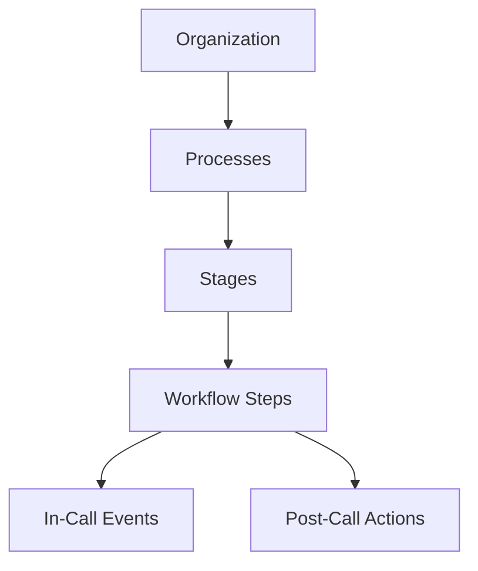

# MantraAssist Product Guide

Welcome to the **MantraAssist Product Guide**! This comprehensive guide is designed for business owners, receptionist agents, managers, and non-technical team members. It outlines what each screen in MantraAssist does, what features are available, why they are helpful in human terms, and how to use them step-by-step.

MantraAssist acts as an automated virtual receptionist and communications coordinator. It placed or receives calls, answers questions using a linked knowledge library, updates client records, schedules appointments, and sends notifications (via text, WhatsApp, or email) to keep your business running smoothly 24/7.

---

## How This Product is Organized

MantraAssist is structured around your business structure:

- **Organization**: Your central account containing business profiles, phone numbers, billings, and custom fields.
- **Processes**: A specific customer path (e.g. "Patient Intake" or "Outbound Reminders").
- **Stages**: Key milestones within a Process (e.g. "Initial Contact", "Insurance Check", "Booking Confirmation").
- **Workflow Steps (Automation)**: Event rules triggered during the call (like verifying an input) or after the call ends (like texting a confirmation link).

---

## User Guide Directory

Explore step-by-step documentation for every screen in the system:

| Screen / Feature | Description | Guide Link |
| :--- | :--- | :--- |
| **Overview Dashboard** | Real-time call volume graphs, success rate summaries, and conversion funnels. | [Overview Dashboard](dashboard.md) |
| **Clients & Contacts** | Database of client details, custom fields, call progression, and timeline logs. | [Client & Contact Management](clients.md) |
| **Call Logs & Recording Player** | Audio playback, visual waveforms, live transcripts, and AI-generated summaries. | [Call Logs & Details](call-logs.md) |
| **Deals Pipeline** | Visual Kanban pipeline cards showing leads, values, and status tracking. | [Deals & Sales Pipeline](deals.md) |
| **Process & Stage Settings** | AI model choosing, voice speed adjustments, timing overrides, and visual workflow builders. | [Process & Stage Configuration](process-settings.md) |
| **Web Forms & Builder** | Capsule metric cards, form templates, drag-and-drop builder, and sandbox tests. | [Web Forms & Form Builder](web-forms.md) |
| **Live Chat** | Real-time texting interface and historic message logs with clients. | [Live Chat Messaging](chats.md) |
| **Appointments & Bookings** | Logged bookings list, interactive calendar views, and team schedules. | [Appointments & Calendar](appointments.md) |
| **Services Setup** | Business offerings details, service durations, and pricing lists. | [Services Management](services.md) |
| **Team & User Roles** | Managing user roles (Admin, Agent, Manager) and calendar sync configurations. | [Team & User Management](users-team.md) |
| **Organizations & Branches** | Switching business profiles and branch locations. | [Organizations](organizations.md) |
| **Billing & Payments** | Subscriptions, invoice lookup, and transaction logs. | [Billing & Payments](billing-payments.md) |
| **Settings & Profile** | Multi-tab settings panel for profile configurations, custom field setups, and API credentials. | [Settings & Profile](settings.md) |
