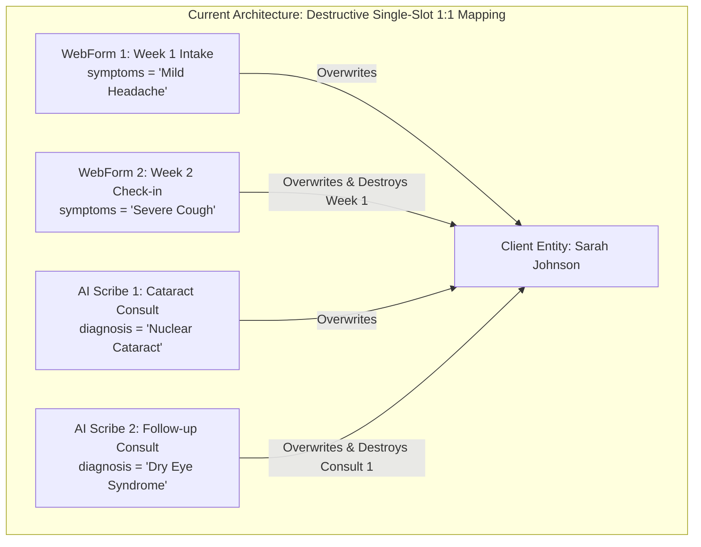
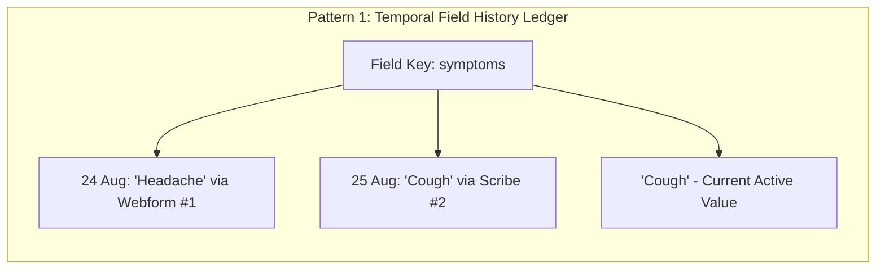
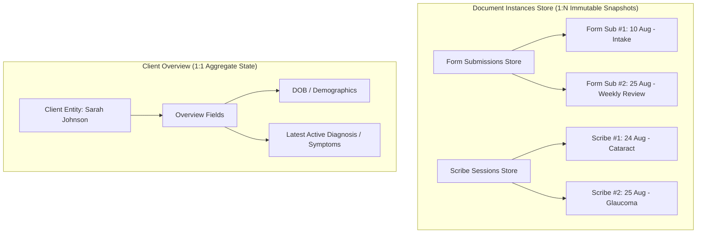

# Platform Architecture RFC: Custom Fields Model & Multi-Event History (WebForms, AI Scribe, CRM Processes)

**Document Status:** Comprehensive Platform RFC  
**Target Modules:** Custom Field Registry (`FieldRegistryContext`), WebForms (`forms.ts`, `submissionsStore.ts`), AI Scribe (`scribeSessionStore.ts`), Client Profile  
**Author:** Core Architecture & Platform Engineering  
**Date:** August 25, 2026  

---

## 1. Executive Summary & The Universal Platform Problem

You have pinpointed the exact structural flaw in the CRM's current architecture: **The issue is not isolated to AI Scribe—it is a fundamental limitation of the Custom Field Model itself.**

### How Custom Fields Work Today (The Flat 1:1 Model)
Currently, in `FieldRegistryContext.tsx` and `ClientProfile.tsx`, custom fields are defined as **flat key-value pairs directly attached to the Client entity (`client[field_key] = value`)**.



### Why This Breaks Across the Entire Platform:
1. **WebForms:** When a client submits an initial intake form (e.g. *Medical History*), and later submits a second form (e.g. *Monthly Symptoms Check-in* or *Post-Op Feedback*), any shared custom field key (e.g., `symptoms`, `pain_score`, `allergies`, `notes`) **overwrites and obliterates the previous form's data**.
2. **AI Scribe Consultations:** Each speech-to-text consultation produces diagnosis, prescriptions, and clinical notes. If mapped to client-level fields, Consultation #2 wipes out Consultation #1.
3. **Loss of Historical Audit Trail:** There is no way to answer: *"What were the patient's symptoms on August 1st vs. August 25th?"* without looking at raw unmapped logs.
4. **The "Field Explosion" Anti-Pattern:** Creating dynamic fields like `symptoms_form_1`, `symptoms_form_2`, `diagnosis_consult_1` causes schema pollution, unmaintainable UI, and destroys reporting.

---

## 2. Industry Standard Solutions (Salesforce, HubSpot, Epic EHR)

Modern enterprise platforms handle this with one of three primary patterns. Here is how they compare:



---

## 3. The 3 Architectural Solutions for Our Platform

---

### Solution 1: Universal Field Value History & Provenance Ledger (Recommended Enterprise Solution)

**Core Idea:** A Custom Field does not store a single scalar value. It stores a **time-series history of values with source provenance (origin form, scribe, or manual edit)**.

#### Data Model (`src/lib/fieldHistoryStore.ts`):
```ts
export interface FieldValueRecord {
  id: string;                       // e.g. "fval-98421"
  fieldKey: string;                 // e.g. "symptoms", "diagnosis", "blood_pressure"
  entityType: "client" | "process";
  entityId: string;                 // e.g. "CL-001"
  value: any;                       // e.g. "Severe Cough"
  
  // Provenance & Audit Metadata
  sourceType: "webform" | "scribe" | "manual" | "telephony" | "workflow";
  sourceRefId?: string;             // formSubmissionId: "sub_102" or scribeSessionId: "scribe_401"
  sourceTitle?: string;             // "Weekly Check-in Form #2" or "Consultation #1"
  updatedBy?: string;               // "Dr. Priya Sharma" or "Client via Webform"
  timestamp: string;                // ISO timestamp: "2026-08-25T09:30:00Z"
}
```

#### How it works in practice:
1. **Reading the Field:**
   - By default, `client.symptoms` resolves to the **Latest Entry** (`ORDER BY timestamp DESC LIMIT 1`).
2. **Viewing the History in UI:**
   - Next to any custom field in the Client Profile or Process Drawer, a small history icon (e.g. `Clock` with count `(3)`) is displayed.
   - Clicking the icon opens a **Field History Popover**:
     ```
     ┌─────────────────────────────────────────────────────────────┐
     │ Field History: Symptoms                                 [X] │
     ├─────────────────────────────────────────────────────────────┤
     │ • 25 Aug 2026, 09:30 AM (AI Scribe #2)                      │
     │   "Severe Cough with fever"                                 │
     │   By: Dr. Priya Sharma                                      │
     │                                                             │
     │ • 18 Aug 2026, 02:15 PM (Webform: Weekly Check-in #1)      │
     │   "Mild dry throat"                                         │
     │   By: Sarah Johnson (Client)                                │
     │                                                             │
     │ • 10 Aug 2026, 11:00 AM (Webform: Initial Intake Form)      │
     │   "No active symptoms"                                      │
     │   By: Sarah Johnson (Client)                                │
     └─────────────────────────────────────────────────────────────┘
     ```
3. **Submissions and Transcripts remain 100% intact:**
   - Form Submission #1 links to its snapshot.
   - Form Submission #2 links to its snapshot.
   - The Client Profile displays the current state + complete historical evolution.

| Pros | Cons |
| :--- | :--- |
| ✅ Zero data loss across WebForms, Scribe, and Manual Edits | Requires a lightweight `fieldHistoryStore` helper |
| ✅ Full audit trail with source provenance | |
| ✅ Solves the problem globally for ALL modules | |
| ✅ Backward compatible with existing scalar field UI | |

---

### Solution 2: Field Scope Classification in Field Registry (`Entity-Level` vs `Event/Time-Series`)

**Core Idea:** In `FieldRegistryContext.tsx`, every custom field is given a **`storageMode`** or **`scope`**:

```ts
export interface FieldDefinition {
  id: number;
  key: string;
  label: string;
  module: FieldModule;
  inputType: FieldInputType;
  
  // NEW: Storage & Overwrite Behavior
  storageMode: "single_overwrite" | "time_series_append" | "list_accumulate";
}
```

#### Field Behavior Matrix:
1. **`single_overwrite` (Static Patient Properties):**
   - Examples: `Date of Birth`, `Gender`, `Blood Group`, `Emergency Contact`, `Insurance Policy Number`.
   - Behavior: When submitted via a form or edited, it updates the single client value because the client only ever has one active value.
2. **`time_series_append` (Clinical / Visit / Temporal Data):**
   - Examples: `Symptoms`, `Blood Pressure`, `Weight`, `Chief Complaint`, `Diagnosis`, `Pain Score`.
   - Behavior: Does not overwrite the previous entry; appends a timestamped entry to the field's timeline.
3. **`list_accumulate` (Tag / Multi-value Lists):**
   - Examples: `Known Allergies`, `Pre-existing Conditions`, `Ongoing Medications`.
   - Behavior: When Form #1 checks "Penicillin" and Form #2 checks "Latex", the client's profile aggregates `[Penicillin, Latex]` without wiping the earlier one.

| Pros | Cons |
| :--- | :--- |
| ✅ Gives the admin full control over how each field behaves | Admin must decide field storageMode when defining fields |
| ✅ Extremely intuitive for forms and scribes | |

---

### Solution 3: Context-Isolated Submissions Store with Living Aggregate Overview

**Core Idea:** A strict separation between **Document Instances (WebForm Submissions & Scribe Sessions)** and **Client Overview Attributes**.



#### How it works:
- **WebForm Submissions:** Saved in `submissionsStore.ts`. When viewing the "Forms" tab in the client drawer, Form #1 and Form #2 are listed as separate submission records with their full distinct responses preserved.
- **Transcripts:** Saved in `scribeSessionStore.ts`. When viewing the "Transcripts" tab, Consultation #1 and Consultation #2 are listed as separate records.
- **Client Overview Custom Fields:** Only displays permanent demographics or an auto-calculated "Latest" summary.

---

## 4. Comparison & Decision Matrix

| Dimension | Current System (Flawed) | Solution 1: Field History Ledger | Solution 2: Field Storage Modes | Solution 3: Context Isolation |
| :--- | :---: | :---: | :---: | :---: |
| **Prevents WebForm Overwrite?** | ❌ No | ✅ **Yes (Full History)** | ✅ **Yes (By Field Type)** | ✅ **Yes (In Forms Tab)** |
| **Prevents AI Scribe Overwrite?** | ❌ No | ✅ **Yes (Full History)** | ✅ **Yes (By Field Type)** | ✅ **Yes (In Transcripts Tab)** |
| **Schema Simplicity** | Flat 1:1 | Time-Series Log | Typed Storage Rules | Separate Sub-stores |
| **UI Complexity** | Basic | Shows History Popover | Auto-handles per mode | Distinct Tabs |
| **Implementation Effort** | None (Broken) | **Low - Medium** | **Low** | **Already 70% in place** |

---

## 5. Recommended Implementation Roadmap for Our App

We can implement a combination of **Solution 1 (History Ledger) + Solution 3 (Context Isolation)** in 3 clean steps:

### Step 1: Immutable Document Storage (Already Established)
- WebForms store their complete raw payload per submission in `submissionsStore.ts`.
- AI Scribe stores its complete clinical payload per consultation in `scribeSessionStore.ts`.
- In the Client Profile Drawer, the **Forms Tab** and **Transcripts Tab** allow opening any previous submission/transcript without any loss of history.

### Step 2: Add `fieldHistoryStore.ts` for Client Custom Fields
- Create a lightweight store `src/lib/fieldHistoryStore.ts` that captures every field change:
  ```ts
  logFieldChange({
    fieldKey: "symptoms",
    entityId: client.id,
    value: "Severe Cough",
    sourceType: "webform",
    sourceTitle: "Weekly Check-in Form #2",
    sourceRefId: submission.id
  });
  ```
- When rendering custom fields in `ClientProfile.tsx`, display the latest value with a subtle `(History)` trigger.

### Step 3: Add `storageMode` to `FieldDefinition` in `FieldRegistryContext.tsx`
- Allow custom fields to be tagged as `single_overwrite`, `time_series_append`, or `list_accumulate`.

---

## 6. Discussion Questions for Final Decision

1. **History UI Preference:** Would you prefer a **clickable clock/history icon** next to each custom field in the Client Profile to view its timeline, or should historical submissions only be browsed via their respective **Forms** and **Transcripts** tabs?
2. **List Accumulation:** For multi-select fields like *Allergies* or *Symptoms*, should subsequent form submissions append new choices or prompt the user?
